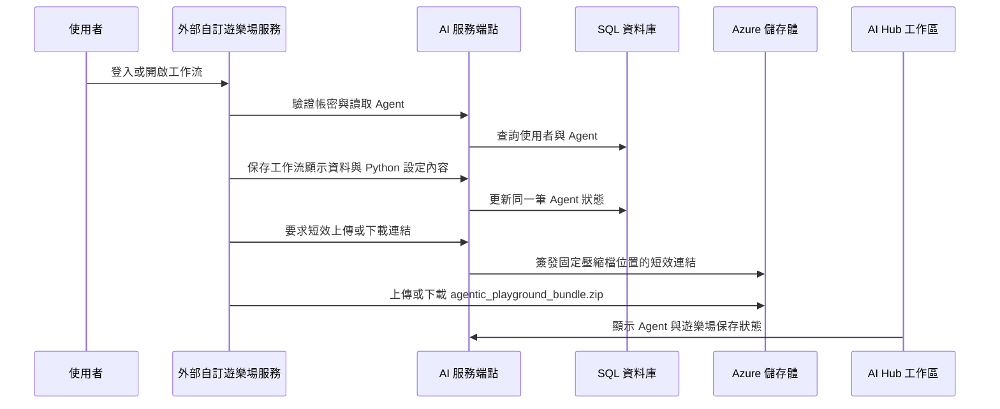

# 整合自訂遊樂場

## 這份文件會幫你完成什麼

當你是平台維護者，手上正在處理外部自訂遊樂場登入失敗、Agent 清單同步異常、工作流設定保存失敗、工作流檔案包讀回失敗，或 AI Hub 工作區狀態更新失敗時，就看這一區。這一區會先固定 AI Hub Portal、AI 服務端點、外部自訂遊樂場服務、SQL 資料庫與 Azure 儲存體之間的責任邊界，讓同一個維護訊號能沿著登入、工作流設定、工作區顯示與檔案包保存一路追查。

外部自訂遊樂場服務負責使用者實際看到的遊樂場畫面、工作流編輯、聊天互動與檔案打包。Agentic SDK 文件已定義 AI Hub 已登入使用者進 Playground 的正式 handoff 方式：AI Hub 以 top-level `POST` 送到 `/playground/aihub/navigation/builder` 或 `/playground/aihub/navigation/runner`，表單帶入短效 handoff token、AI Hub API base URL 與必要的 `agent_id`，再由 Playground 建立 session 並 redirect 到 Builder 或 Runner。AI Hub 不把使用者明文密碼交給瀏覽器 handoff；帳密登入流程保留給 Playground 站內登入與相容 API。三頁外部文件也定義外部服務呼叫 AI Hub 的 `config` / `bundle` API；它們不是一般瀏覽器 query string 契約。這個分工讓平台維護者可以把畫面問題、導航問題、資料問題與檔案保存問題分開查證。

## 主流程總覽

自訂遊樂場整合主線分成五段。第一段，AI Hub 依使用者位置決定要進公開 `/playground`、Builder handoff、Runner handoff，或公開唯讀 Runner。第二段，外部自訂遊樂場服務依 AI Hub connection model 驗證使用者身分，並取得或建立同一個帳號底下的 Agent；公開唯讀 Runner 則用公開載入 API 讀取已分類公開的 Agent 設定。第三段，外部服務把工作流名稱、摘要與 Python 設定內容保存回 AI Hub，讓 AI Hub 工作區可以顯示同一筆 Agent 的目前狀態，並由工作區的類型欄位決定是否進入 Gallery。第四段，Runner 執行 Agentic SDK workflow 時，外部服務把 SDK 的 stage event 轉成畫面狀態，讓使用者在最終文字輸出前知道目前正在理解輸入、查找資料、規劃流程或準備回覆。第五段，當工作流需要保存原始支援文件、檢索索引檔或其他執行所需檔案時，AI Hub 簽發短效上傳或下載連結，外部服務直接對 Azure 儲存體存取固定壓縮檔。

圖 1 固定自訂遊樂場整合的主要責任交接。平台維護者讀圖時，先確認問題停在外部自訂遊樂場服務、AI 服務端點、SQL 資料庫、工作區顯示，還是 Azure 儲存體；後續再進入對應子頁查端點、欄位與成功訊號。

圖 1、自訂遊樂場、AI Hub 與 Azure 儲存體之間的責任交接順序。

## 平台要維護哪些資源

這一節用來對照自訂遊樂場整合主線中，各個平台主體各自要維護哪些內容。

1. 外部自訂遊樂場服務：承接使用者實際操作自訂遊樂場的畫面、公開 `/playground` 首頁、Builder、Runner 可編輯狀態、Runner 唯讀聊天狀態、工作流編輯、聊天互動、Runner 階段狀態顯示、壓縮檔打包，以及對 Azure 儲存體的上傳與下載。
2. AI 服務端點：承接帳密驗證、來源網域檢查、工作流設定讀寫、Agent 清單回傳、短效檔案連結簽發，以及錯誤格式回應。
3. SQL 資料庫：承接使用者、Agent 主體、工作流名稱、摘要、Python 設定內容、遊樂場保存狀態與最近匯出時間。
4. Azure 儲存體：承接每個 `agent_id` 對應的固定 `agentic_playground_bundle.zip` 檔案。Azure 儲存體回應上傳或下載成功，才是工作流檔案包保存與讀回的直接證據。
5. AI Hub 工作區：承接登入後的 Agent 工作流程清單與自訂遊樂場入口，讓維護者能從畫面確認同一筆 Agent 是否已保存工作流設定、顯示最新名稱與摘要、選擇 Gallery 類型，並能進入外部自訂遊樂場服務。

上述五個主體共同形成自訂遊樂場整合的維運責任鏈。要查登入、Agent 選擇、工作流設定讀寫與 AI Hub/外部服務分工，進入 [連線方式與責任邊界](connection-and-responsibility.md)；要查工作流檔案包如何取得短效連結、保存到 Azure 儲存體並讀回，進入 [工作流保存與讀回](workflow-save-load.md)。

## 接下來看哪一頁

這一節用來對照目前要確認的是哪一段處理內容，供平台維護者快速判斷下一步該讀哪一頁。

| 目前要確認的事 | 對應頁面 |
| --- | --- |
| AI Hub 各導覽位置應該進入公開 `/playground`、Builder handoff、Runner handoff 或公開唯讀 Runner 流程，以及外部自訂遊樂場服務如何驗證身分、讀取 Agent、保存工作流設定，並與 AI Hub 工作區維持同一筆 Agent 狀態 | [連線方式與責任邊界](connection-and-responsibility.md) |
| Runner 執行 workflow 時，畫面如何在最終回覆前顯示目前階段，以及維護者如何判斷階段狀態、工作流設定與最終回覆的責任邊界 | [Runner 階段狀態](runner-stage-status.md) |
| 同一筆 Agent 的工作流檔案包如何取得短效上傳或下載連結，並由外部服務直接存取 Azure 儲存體 | [工作流保存與讀回](workflow-save-load.md) |

## 完成這區後要保證什麼

完成本區後，平台維護者應能把自訂遊樂場問題整理成可追查的維護證據：問題出現在哪個外部服務或 AI Hub 工作區入口、使用哪個帳號與 `agent_id`、呼叫哪個 API 端點、SQL 中同一筆 Agent 是否更新、Azure 儲存體中的固定壓縮檔是否能上傳與下載，以及下一步應交給連線責任、資料責任或雲端儲存責任確認。