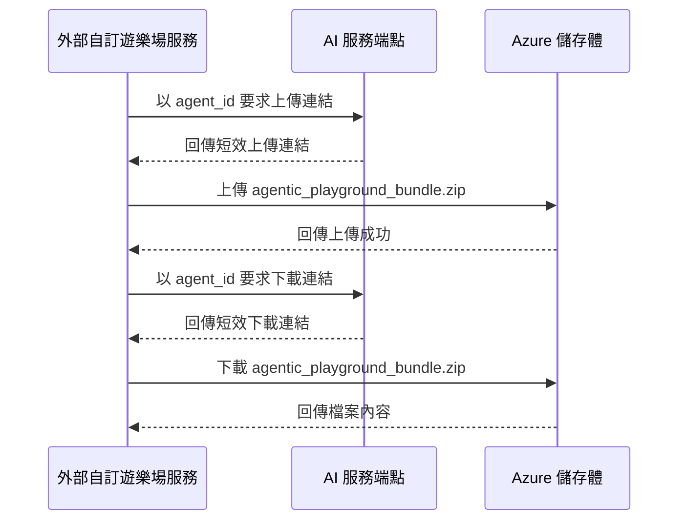

# 工作流保存與讀回

## 這份文件會幫你完成什麼

當你是平台維護者，正在確認同一筆 Agent 的工作流檔案包保存到 Azure 儲存體失敗、重新開啟時檔案讀回失敗，或外部自訂遊樂場服務拿到短效連結後上傳或下載失敗時，就看這一頁。這一頁定義 AI Hub 如何用 `agent_id` 驗證權限並簽發短效上傳或下載連結，讓外部自訂遊樂場服務直接保存與讀回整包 `agentic_playground_bundle.zip`。

這一頁接續 [連線方式與責任邊界](connection-and-responsibility.md)。工作流設定保存先以 v2 `workflow_spec` 建立或更新 Agent，並保存工作流名稱、摘要、Runner 顯示資料與衍生程式碼；本頁處理同一個 `agent_id` 底下的工作流檔案包。AI Hub 負責驗證權限與簽發短效連結；外部自訂遊樂場服務負責打包、上傳、下載與還原檔案內容。

## 平台如何完成工作流保存與讀回

工作流保存與讀回分成兩段。第一段，外部自訂遊樂場服務在已取得 `agent_id` 後，要求 AI Hub 簽發指向固定壓縮檔位置的短效上傳連結，然後直接把檔案上傳到 Azure 儲存體。第二段，使用者重新開啟同一個 Agent 時，外部服務要求 AI Hub 簽發短效下載連結，然後直接從 Azure 儲存體取回同一包檔案，交由 Agentic SDK 與 `SemanticRetrieve` 還原工作流狀態。

圖 1 固定 AI Hub 與 Azure 儲存體在檔案保存中的責任分工。維護者讀圖時，先確認 AI Hub 已簽發短效連結，再確認外部服務已用該連結對 Azure 儲存體完成上傳或下載；`issued_at` 是連結簽發時間，檔案保存結果以 Azure 儲存體的上傳回應為準。



圖 1、外部自訂遊樂場服務經由短效連結保存與讀回工作流檔案包。

## 檔案儲存位置與責任邊界

每個 `agent_id` 有一個固定工作流檔案包位置。AI Hub 簽發的短效上傳與下載連結都指向這個位置。

```text
playground-agents/{agent_id}/bundle/agentic_playground_bundle.zip
```

`agentic_playground_bundle.zip` 的內部結構由外部自訂遊樂場服務、Agentic SDK 與 `SemanticRetrieve` 定義。這包檔案可以包含 v2 workflow contract、衍生 Python 程式碼、原始支援文件、檢索索引檔與檔案清單。AI Hub 的維護責任集中在使用者權限、短效連結、固定儲存位置與 Azure 儲存體回應；檔案內部如何組成與還原，由外部服務與相關 SDK 負責。

目前交付範圍是為固定工作流檔案包簽發短效上傳與下載連結。平台維護者在本頁查證同一包壓縮檔是否能保存與讀回；逐檔管理、檔案生命週期、容量配額、保留天數、版本管理與向量資料庫查詢屬於後續獨立功能。

## 工作流檔案 API 參考

工作流檔案 API 沿用既有自訂遊樂場工作流設定 API 的身分驗證與來源網域檢查。Playground 站內手動登入可使用帳密；AI Hub handoff session 則可使用短效 token 或 credential ticket 所代表的同一個帳號與 `agent_id`。`bundle/save` 回傳短效上傳連結；`bundle/load` 回傳短效下載連結。正式 API 傳遞的是連結與必要標頭，檔案內容由外部服務直接送到 Azure 儲存體或從 Azure 儲存體取回。

| 操作 | 方法與端點 | 認證位置 | 成功結果 |
| --- | --- | --- | --- |
| 取得工作流檔案包上傳連結 | `POST /api/playground/agents/<agent_id>/bundle/save` | JSON 內容中的 `username`、`password`；或 handoff token / credential ticket 對應的同一帳號 | 回傳可上傳 `agentic_playground_bundle.zip` 的短效連結、HTTP 方法與必要標頭。 |
| 取得工作流檔案包下載連結 | `GET /api/playground/agents/<agent_id>/bundle/load` | `X-Playground-Username`、`X-Playground-Password` 標頭；或 handoff token / credential ticket 對應的同一帳號 | 回傳可下載 `agentic_playground_bundle.zip` 的短效連結。 |

外部自訂遊樂場服務呼叫這些 API 時，帶入合法的來源網域。AI Hub 會確認使用者能操作該 `agent_id`，再簽發對應連結。

## 取得上傳連結並保存檔案包

使用者在外部自訂遊樂場服務完成工作流編輯，並由 Agentic SDK 或 `SemanticRetrieve` 準備好整包執行所需檔案後，外部服務呼叫 `bundle/save`。AI Hub 確認使用者擁有該 `agent_id` 後，回傳指向固定檔案位置的短效上傳連結。

請求範例：

```json
{
  "username": "alice",
  "password": "correct-password"
}
```

回應範例：

```json
{
  "agent_id": "agt_001",
  "issued_at": "2026-07-28T12:00:00Z",
  "bundle_root": "playground-agents/agt_001/bundle",
  "bundle_path": "playground-agents/agt_001/bundle/agentic_playground_bundle.zip",
  "upload_url": "https://<account>.blob.core.windows.net/<container>/playground-agents/agt_001/bundle/agentic_playground_bundle.zip?...",
  "upload_url_expires_at": "2026-07-28T12:15:00Z",
  "upload_method": "PUT",
  "upload_headers": {
    "x-ms-blob-type": "BlockBlob"
  }
}
```

外部自訂遊樂場服務拿到回應後，直接用 `upload_method`、`upload_url` 與 `upload_headers` 把 `agentic_playground_bundle.zip` 上傳到 Azure 儲存體。保存完成的成功訊號來自 Azure 儲存體對上傳請求的成功回應。

`bundle/save` 與 `POST /api/playground/contract/save` 是同一筆 Agent 的兩段維護證據。外部服務必須先保存 v2 `workflow_spec` 取得或確認 `agent_id`，再以該 id 保存 bundle；衍生 Python 程式碼不能取代 contract。AI Hub 工作區清單以 contract 的名稱、摘要與保存狀態顯示目前工作流。

## 取得下載連結並讀回檔案包

使用者重新開啟同一個 Agent 時，外部自訂遊樂場服務呼叫 `bundle/load`。AI Hub 確認使用者擁有該 `agent_id` 後，回傳指向固定檔案位置的短效下載連結。

請求標頭範例：

```text
Origin: https://agentic-sdk-playground.azurewebsites.net
X-Playground-Username: alice
X-Playground-Password: correct-password
```

回應範例：

```json
{
  "agent_id": "agt_001",
  "bundle_path": "playground-agents/agt_001/bundle/agentic_playground_bundle.zip",
  "download_url": "https://<account>.blob.core.windows.net/<container>/playground-agents/agt_001/bundle/agentic_playground_bundle.zip?...",
  "download_url_expires_at": "2026-07-28T12:15:00Z",
  "download_method": "GET"
}
```

外部自訂遊樂場服務拿到回應後，直接用 `download_method` 與 `download_url` 從 Azure 儲存體下載檔案，再交給 Agentic SDK 或 `SemanticRetrieve` 還原工作流狀態。

## 第一次保存與重新開啟流程

1. 外部自訂遊樂場服務第一次保存新工作流時，先依 [連線方式與責任邊界](connection-and-responsibility.md) 呼叫工作流設定保存 API，讓 AI Hub 建立新 Agent 並回傳 `agent_id`。
2. 外部服務以該 `agent_id` 建立 `agentic_playground_bundle.zip`，檔案內包含 Agentic SDK 或 `SemanticRetrieve` 需要的 v2 workflow contract、原始支援文件、檢索索引檔與檔案清單。
3. 外部服務呼叫 `bundle/save`，取得短效上傳連結。
4. 外部服務直接把整包檔案上傳到 Azure 儲存體的固定位置，並確認 Azure 儲存體回傳成功狀態。
5. 使用者再次開啟同一個 Agent 時，外部服務先呼叫工作流設定讀取 API，再呼叫 `bundle/load` 取得短效下載連結。
6. 外部服務直接從 Azure 儲存體下載檔案，確認取回同一包檔案，並交由 Agentic SDK 自行還原工作流狀態。

## 查完這頁後應該留下什麼

查完這一頁後，平台維護者應該能留下同一筆檔案保存問題的證據包：使用者帳號、`agent_id`、工作流檔案 API 回應、短效連結到期時間、固定檔案位置、Azure 儲存體上傳/下載回應，以及外部服務是否將同一包檔案交給 Agentic SDK 或 `SemanticRetrieve` 還原。

1. 保存問題：留下 `bundle/save` 回應、`upload_url_expires_at`、上傳使用的 方法/標頭、Azure 儲存體上傳成功或失敗回應。
2. 讀回問題：留下 `bundle/load` 回應、`download_url_expires_at`、Azure 儲存體下載成功或失敗回應。
3. 權限問題：留下來源網域、使用者帳號、`agent_id` 與 AI Hub 對該 Agent 的讀寫權限判斷。
4. 內容還原問題：留下外部服務取得的壓縮檔、Agentic SDK 或 `SemanticRetrieve` 還原結果；AI Hub 的證據集中在權限、短效連結、檔案位置與 Azure 儲存體回應。

當固定檔案位置可上傳、可下載，且外部服務能用同一包檔案還原工作流狀態時，以 Agent 為範圍的檔案保存流程才算成立。