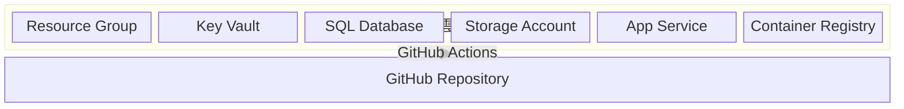

# 雲端部署資源

## 這份文件會幫你完成什麼

當你負責維護正式網站，需要確認網站目前是哪一次 GitHub Actions 部署上線，或需要搬移正式資料庫，就看這一頁。本頁說明 GitHub Actions 如何把網站部署到 Azure，以及搬移資料庫時要留下哪些紀錄，讓後續維護者能確認網站目前連到哪一個資料庫。

本頁將會先說明 GitHub 程式碼庫、GitHub Actions 與 Azure 正式環境的部署關係，再說明正式資料庫搬移時要保存的備份、還原與切換紀錄。讀完後，維護者應能指出部署紀錄、GitHub Actions 設定位置、Key Vault 連線值位置、App Service 狀態與資料庫搬移紀錄。

## GitHub 如何維護 Azure 資源

GitHub 程式碼庫保存網站程式與部署流程。GitHub Actions 執行部署時，會使用程式碼庫中的設定登入 Azure，並把網站部署到正式環境。圖 1 固定 GitHub 程式碼庫、GitHub Actions 與 Azure 正式環境的相對位置，讓維護者先看部署從哪裡開始，再看部署結果落在哪個 Azure 環境。

圖 1、GitHub repository 經由 GitHub Actions 建置 Azure 正式網站的路徑圖。

在 GitHub 程式碼庫中，開啟 **Settings > Secrets and variables > Actions**，確認部署會使用的 Variables 與 Secrets。Variables 記錄正式 Azure 資源位置，Secrets 記錄 Azure 登入資料。GitHub Actions 執行前，先確認下列六項值；前三項讓部署流程找到正式 Azure 資源，後三項讓部署流程可以登入 Azure。

* `AZURE_RESOURCE_GROUP=ai-hub-webui`
* `AZURE_KEY_VAULT_NAME=ai-hub-secret-key`
* `AZURE_REGION=<正式部署區域>`
* `AZURE_CLIENT_ID=<Azure 登入用 client id>`
* `AZURE_TENANT_ID=<Azure tenant id>`
* `AZURE_SUBSCRIPTION_ID=<Azure subscription id>`

在 Azure Portal 的 Key Vault secrets 頁，確認 App Service 啟動網站、連線正式資料庫與保存 Playground 檔案所需的值。Playground 檔案使用 Azure Storage Account 的 blob container；GitHub Actions 會建立或更新 Storage Account、建立 container，並授權 App Service 的 managed identity 存取 blob。網站使用哪一個資料庫與哪一個 Playground 檔案容器，以 Key Vault 中的連線值與儲存體名稱為準。

Playground 檔案儲存要在 Key Vault secrets 頁設定兩個值，讓部署流程知道要維護哪個 Storage Account 與 blob container。

* `PLAYGROUND-STORAGE-ACCOUNT-NAME=<全域唯一的小寫 Storage Account 名稱>`
* `PLAYGROUND-STORAGE-CONTAINER-NAME=playground-agent-files`

需要調整儲存體規格或保留天數時，在 GitHub 程式碼庫的 **Settings > Secrets and variables > Actions > Variables** 設定下列 optional Variables。未設定時，部署流程使用 `Standard_LRS` 與 `7` 天。

* `PLAYGROUND_STORAGE_ACCOUNT_SKU=Standard_LRS`
* `PLAYGROUND_STORAGE_SOFT_DELETE_DAYS=7`

部署後，在 GitHub Actions 執行紀錄、App Service 概觀頁、Azure Storage Account container 頁與正式網站 `/healthz` 回應中確認同一次部署已完成。

## 核心資料的備份、還原與轉移

正式資料庫搬移時，本頁保存三段雲端紀錄：原資料庫匯出成備份檔、備份檔還原到新資料庫、App Service 改用新資料庫。每一段都要留下可查的紀錄，讓後續維護者知道資料從哪裡來、還原到哪裡，以及網站何時完成切換。

### 備份原正式 Azure SQL Database

備份前，先確認正式網站目前連到哪一個資料庫。App Service 讀到的 SQL 設定，應該和 Key Vault 保存的 SQL 連線值指向同一個正式資料庫。確認來源後，把原正式 Azure SQL Database 匯出成備份檔；這個檔案就是後續還原到新資料庫的來源。

1. 在 App Service 設定與 Key Vault SQL 連線值中，確認正式網站目前連到的來源資料庫。
2. 從來源 Azure SQL Database 匯出備份檔。
3. 在備份保存紀錄中寫下備份檔位置、匯出時間與操作者。

完成備份後，維護紀錄保存來源資料庫與備份檔位置。後續還原時，使用同一份備份檔匯入新 SQL Database。

### 還原備份到新 SQL Database

還原時，使用前一段匯出的備份檔，把資料匯入新的 Azure SQL Database。這一步的目標是讓新資料庫具備原正式資料庫的資料狀態。

1. 在 Azure SQL Database 中選定要接收資料的新資料庫。
2. 使用備份檔還原到新 SQL Database。
3. 還原完成後，記錄新資料庫名稱與還原時間。
4. 確認新資料庫可以被後續 App Service 連線切換使用。

完成還原後，下一段才更新 Key Vault 中的 SQL 連線值，讓 App Service 改用新的 SQL Database。

### 切換 App Service 使用新資料庫

切換時，先把新資料庫的連線值寫入 Key Vault，再讓 App Service 重新讀取設定，最後到正式網站確認功能是否正常。切換紀錄要保存維護時間、資料時間差、新舊資料庫對照，以及網站驗證結果。

1. 在維護紀錄中寫下備份完成時間、網站切換時間、寫入暫停時間、寫入恢復時間與允許落差時間。
2. 在 Azure Key Vault secrets 頁更新新正式資料庫的 SQL 連線值，並保存新舊資料庫對照。
3. 在正式環境位置改變時，更新 GitHub Actions Variables，讓後續部署流程能找到新的正式資源。
4. 在 GitHub Actions 頁重新執行部署流程，或在 Azure Portal 重新啟動 App Service，讓網站重新讀取 Key Vault 與 SQL 設定。
5. 在正式網站完成登入、模型列表、部署設定、管理端資源頁與受控寫入操作，並把結果寫入網站驗證紀錄。

切換完成後，維護紀錄保存 Key Vault SQL 連線值版本、App Service 重新讀取設定的時間、正式網站驗證結果與原資料庫保留狀態。這些紀錄讓資料庫搬移可以對回同一次備份、還原與切換，並把後續查證入口留在維護紀錄或專門 runbook。

## 完成這頁後要保證什麼

完成後，部署紀錄要能對回同一次上線，資料庫搬移紀錄要能對回同一次備份、還原與切換。維護者應能從正式網站回應、App Service 部署結果、Key Vault SQL 連線值、Azure SQL Database 資料狀態與 Azure Storage Account container 狀態，看出目前正式網站使用哪一份程式、哪一個資料庫與哪一個 Playground 檔案容器。