# 資料庫結構與責任

## 這份文件會幫你完成什麼

當你是平台維護者，正在從 API 結果、WebUI 畫面、SQL 表名、資料列、audit record、備份結果、模型發布、帳號治理、群組治理、Agent 維護或部署設定追查 SQL Server 中的正式資料責任時，就看這一頁。這一頁會幫你判斷手上的問題落在哪個資料功能域，並確認後續要沿哪一條資料責任鏈追查。

使用這一頁時，先判斷問題屬於哪一組 API 服務，再找到對應的 SQL 資料功能域。進入該功能域後，再確認主體、欄位、外鍵與狀態欄位是否能支持目前的維護判斷。

## 從 API 服務對照資料功能域

資料庫排查接續 [API 服務與端點](platform-services-and-business-processing.md) 定義的五大服務分組。API 服務名稱沿用 API 頁；SQL 資料功能域名稱沿用本頁 `## 資料功能域分組` 底下的十個主題。圖 1 表示跨層追查對照，線條說明 API 服務如何落到 SQL 資料責任，並不表示兩邊必須同名。

圖 1 用來把 API 服務分組對到 SQL 資料功能域。讀圖時先從畫面或端點定位 API 服務，再看它落到哪一個資料功能域；進入功能域後，再檢查主鍵、外鍵、複合主鍵、狀態欄位與時間欄位。

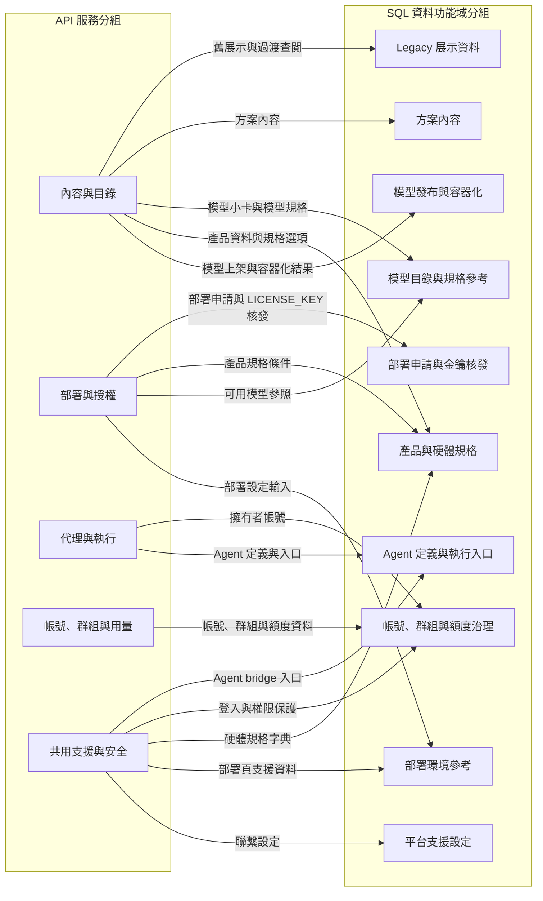

圖 1、API 服務分組與 SQL 資料功能域分組對照。

圖後進入各主題時，維護者應把圖中的跨層對照轉成單一資料功能域內的主鍵、外鍵、複合主鍵、狀態欄位與時間欄位檢查。

## 資料功能域分組

平台資料責任依維護者實際追查的功能域拆分。每個主題都先說明資料如何進入資料層，再用 ER 子圖固定主體、核心欄位與關聯。讀者應先找最接近目前問題的主題，再進入該主題內判斷主鍵、外鍵、狀態與時間欄位是否能支持目前的維護工作。

### 模型發布與容器化

模型發布與容器化從模型發布方在「我的模型」送出上架資料開始。平台會把部署裝置、模型架構資料與 OpenAI SDK 支援資訊固定到同一張模型小卡，再由這些資料產生發布憑證（`model_card.yaml`）。CI/CD 自動交付流程完成驗證、建置與推送後，會把 OpenAI SDK 驗證結果與登錄位置更新到同一張模型小卡。

圖 2 用來確認模型上架資料與容器化結果如何落到資料層。讀圖時先看模型小卡，再確認它對應的產品規格選項與模型變體，並由模型變體回到模型資料；若模型清單或部署選項顯示不一致，再檢查發布結果欄位是否已完成更新。

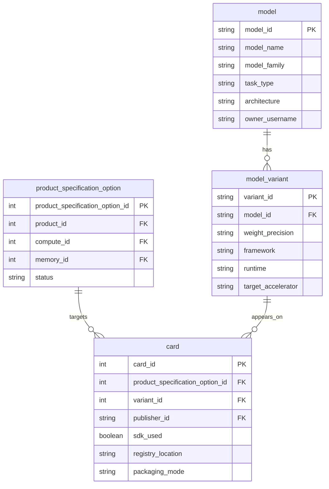

圖 2、模型發布與容器化 ER 子圖。

圖後判讀時，`card_id` 固定同一張模型小卡，`product_specification_option_id` 固定部署裝置與產品規格條件，`variant_id` 把模型小卡接到模型變體、再由模型變體以 `model_id` 回到模型資料，固定模型架構與變體資訊。`sdk_used`（OpenAI SDK 宣告）與 `registry_location` 是 CI/CD 自動交付流程更新到模型小卡的容器化結果；若兩者缺漏或不一致，維護者應回到發布憑證與結果回寫資料確認同一張模型小卡是否完成交付。

### 帳號、群組與額度治理

帳號、群組與額度治理從登入帳號開始，延伸到群組、角色、額度與治理歷程。使用者看到的角色、群組成員或 Budget / Credit 通常是目前狀態；維護者要追的是這個狀態是否有對應的成員關聯、額度事件與 audit record。這條鏈的重點在於把 username 和 group_id 放在同一個治理脈絡裡，讓帳號狀態、群組關係與治理紀錄能一起判讀。

圖 3 用來確認帳號和群組的交會點。`app_user` 固定帳號主體，`account_group` 固定群組主體，`account_group_member` 是兩者關係是否生效的轉折；額度與角色異動則分別回到 score 與 audit 紀錄，讓維護者判斷畫面上看到的是目前狀態還是歷程結果。

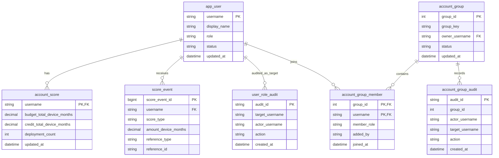

圖 3、帳號、群組與額度治理 ER 子圖。

圖後判讀時，`username` 是帳號、額度、額度事件與群組成員關係的共同索引；`group_id` 是群組主體、成員關係與群組 audit 的共同索引。`account_score` 保存目前額度摘要，`score_event` 保存異動事件；`role`、`status`、`member_role` 與 `action` 則讓維護者判斷目前權限和歷程紀錄是否互相支持。

### Agent 定義與執行入口

Agent 定義與執行入口承接個人工作區和外部 Playground 共同操作的 Agent 定義。使用者可能從個人工作區建立 Agent，也可能從外部 Playground 讀取或更新同一筆 Agent；資料庫在這裡固定的是 Agent 定義、擁有者、工作流內容與執行入口。這條界線讓維護者能判斷 SQL 中保存的是哪一筆可執行定義，以及這筆定義屬於哪個帳號。

圖 4 用來確認 Agent 定義和擁有者的關係。讀圖時只要先確認 `agent_workspace_agent` 是否指向正確的 `app_user`，就能判斷個人工作區端點和外部 Playground 是否正在操作同一個帳號底下的同一筆 Agent。

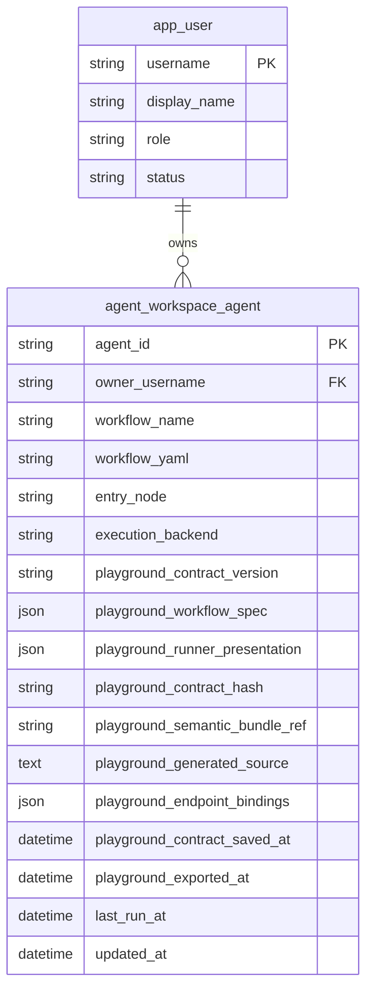

圖 4、Agent 定義與執行入口 ER 子圖。

圖後判讀時，`agent_id` 固定單一 Agent 定義，`owner_username` 讓它回到擁有者帳號，`workflow_yaml`、`entry_node` 與 `execution_backend` 說明工作區定義與執行入口如何被保存。

外部 Playground 的 v2 保存以 `playground_contract_version` 與 `playground_workflow_spec` 為主體，`playground_contract_hash` 供維護者比對保存版本；這三者用於判斷可否重新編輯同一個 workflow。`playground_runner_presentation`、`playground_generated_source`、`playground_endpoint_bindings` 與兩個保存時間則支援 Runner 顯示、程式碼匯出、模型端點追查與保存時序。`playground_semantic_bundle_ref` 只保存檔案包參照，實際 bundle 仍由外部服務透過短效連結管理。維護者先以 `agent_id` 與 `owner_username` 確認權限，再把這些欄位對照 `POST /api/playground/contract/save`、config load 與 bundle save/load 的回應；`last_run_at` 和 `updated_at` 則用來判斷定義是否曾被執行或更新。

### 產品與硬體規格

產品與硬體規格承接正式產品主線。產品提供者在管理端維護產品名稱、型號、vendor、可選硬體規格與資源連結，公開產品頁再把這些資料呈現給使用者和模型發布方。這個主題的排查重點是同一個 product 是否帶著正確規格選項與資源連結，並和 legacy 硬體展示資料保持清楚邊界。

圖 5 用來確認正式產品資料如何組成。讀圖時先看 `product`，再看它提供的 `product_specification_option` 和 `product_resource_link`；`hardware_ic_vendor` 是產品和硬體規格的 vendor 參照，hardware 在這裡代表規格與 vendor 語意。

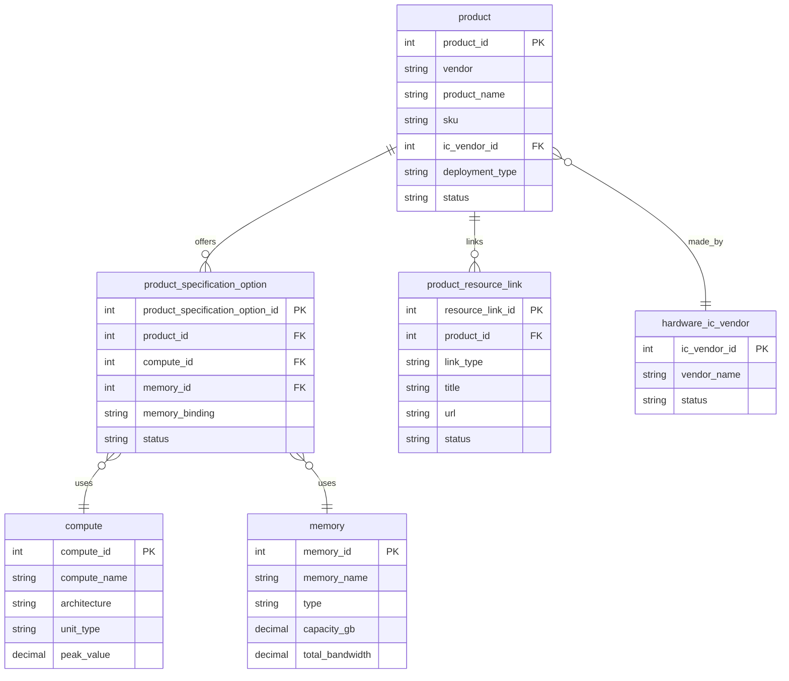

圖 5、產品與硬體規格 ER 子圖。

圖後判讀時，`product_id` 固定正式產品主體，`product_specification_option_id` 固定該產品可選的算力與記憶體組合。`compute_id`、`memory_id` 與 `memory_binding` 說明硬體規格如何支援產品選項；`resource_link_id`、`link_type` 與 `status` 則說明產品資源連結是否仍有效。

### 模型目錄與規格參考

模型目錄與規格參考承接公開模型小卡和部署前的模型規格選擇。模型小卡讓使用者看到可瀏覽、可部署的模型；模型家族、模型變體、算力與記憶體規格則讓維護者確認模型卡上的規格描述是否有共同來源。這個主題的排查重點是同一張 card 是否對到正確模型、變體與規格參照。

圖 6 用來確認模型目錄和規格參考的關係。讀圖時先看 `card`，沿 `variant_id` 看它連到的 `model_variant`，再由 `model_variant` 的 `model_id` 回到 `model` 確認模型與變體；硬體規格則看 `card` 的 `compute` 與 `product_specification_option` 提供的 `memory`。

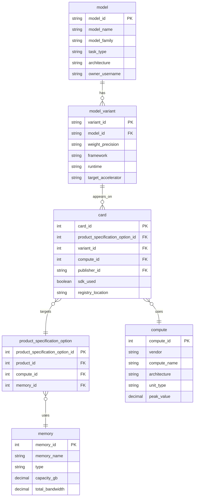

圖 6、模型目錄與規格參考 ER 子圖。

圖後判讀時，`card_id` 固定公開模型小卡，`variant_id` 把模型小卡接到模型變體、再由 `model_variant` 的 `model_id` 回到模型，`product_specification_option_id` 則把模型小卡接到產品規格選項。模型規格由 `model` 與 `model_variant` 描述，硬體規格由 `card` 的 `compute` 與產品規格選項提供的 `memory` 共同支援。

### 部署環境參考

部署環境參考承接部署頁需要的 runtime、vendor、stack、OS 與相容硬體資訊。這些資料讓部署頁能提供可選環境，也讓維護者判斷模型和產品是否能接到同一組部署條件。這個主題保存部署前的環境參考資料；授權核發、金鑰與容器啟用結果不寫在 `tool_deployment_runtime`。

圖 7 用來固定 deployment runtime 和 vendor 的參照關係。讀圖時先看 `tool_deployment_runtime` 的 runtime、stack、OS 與相容硬體，再看它引用的 `hardware_ic_vendor` 是否能和產品或模型部署條件對上。

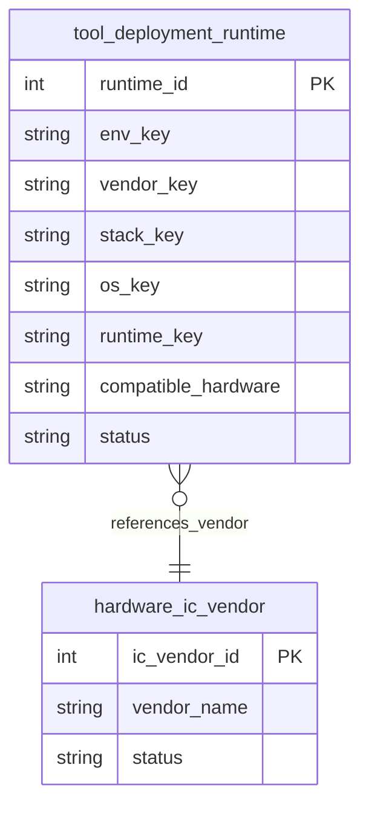

圖 7、部署環境參考 ER 子圖。

圖後判讀時，`runtime_id` 固定一筆部署環境參考；`env_key`、`vendor_key`、`stack_key`、`os_key` 與 `runtime_key` 組成唯一條件。`compatible_hardware` 保存可搭配的硬體描述，`status` 和 `display_order` 決定資料是否仍可被選用與排序。

### 部署申請與金鑰核發

部署申請與金鑰核發承接一般使用者在「我的部署」送出的部署目標、使用月數與主機識別資訊。資料庫在這裡固定單筆部署紀錄、正式授權內容與核發結果，讓 `LICENSE_KEY` 的交付、秘密參照、容器端驗章、裝置檢查與過期檢查都能回到同一筆部署結果。

圖 8 用來確認部署申請如何形成正式授權內容。讀圖時先看部署紀錄是否指向正確使用者與模型小卡，再看正式授權內容是否保存同一筆申請形成的核發時間、到期時間與主機綁定結果，最後用核發紀錄與 `secret_ref` 確認啟用金鑰連到受控保存位置。

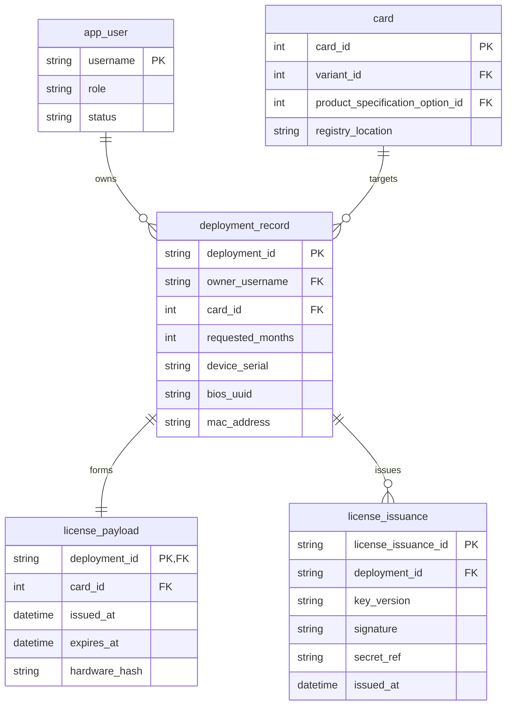

圖 8、部署申請與金鑰核發 ER 子圖。

`deployment_id` 固定單筆部署申請，`owner_username` 與 `card_id` 固定申請者與部署目標。使用月數與主機識別資訊是正式授權內容形成前的來源資料；核發時間、到期時間與主機綁定結果是簽章與容器端驗證共同使用的正式授權內容。`secret_ref` 保存啟用金鑰的秘密參照，讓資料庫能追蹤交付對應。

### 方案內容

方案內容承接公開方案與個人工作區維護的方案資料。方案本身是能力展示與內容入口，資料責任集中在同一個 solution 是否保存正確的標題、分類、領域、展示內容、圖片與必要的模型小卡參照。

圖 9 用來確認方案內容主體。讀圖時先看 `platform_solution`，再看它是否透過 `card_id` 連到模型小卡主體；方案公開展示與工作區維護都以這筆 solution 內容為起點。

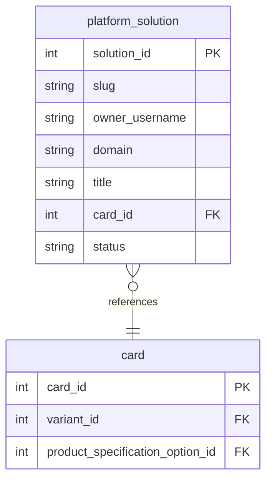

圖 9、方案內容 ER 子圖。

圖後判讀時，`solution_id` 固定方案主體，`slug` 固定公開路徑，`owner_username` 保留內容維護者，`domain`、`title` 與 `status` 支援方案分類、呈現與生命週期判讀。`card_id` 讓方案內容引用模型小卡，維護者可以用它確認方案展示內容是否對到正確模型資料。

### 平台支援設定

平台支援設定處理多個頁面共同讀取的支援資料。聯繫頁的管道、摘要、聯絡方式與按鈕文案會影響公開頁和管理端能否呈現正確支援資訊，因此獨立成域；維護者查產品、模型或部署資料時，聯繫設定只由這個主題中的支援資料欄位承擔。

圖 10 用來固定平台支援設定目前的獨立主體。讀圖時只需確認聯繫管道資料本身是否存在、狀態是否正確，以及管理端更新後公開頁是否讀到同一筆設定。

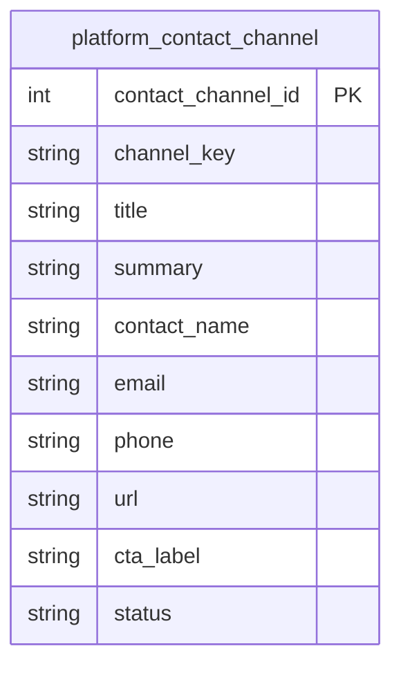

圖 10、平台支援設定 ER 子圖。

圖後判讀時，`contact_channel_id` 固定單一聯繫管道，`channel_key` 防止同類管道重複建立，`title`、`summary`、`contact_name`、`email`、`phone`、`url` 與 `cta_label` 組成頁面可呈現的支援資料。`status` 與 `display_order` 決定資料是否仍可使用與呈現順序。

### Legacy 展示資料

Legacy 展示資料用來處理過渡期間仍可能被查到的舊硬體展示資料。正式產品維護已回到 `product` 主線；維護者看到 `hardware_device*` 表名、舊 API alias 或過渡內容時，應先判斷它是在支援舊展示查閱，還是有資料仍未遷回正式產品主線。

圖 11 用來固定 legacy 硬體展示資料的邊界。讀圖時先看 `hardware_device`，再看它附帶的 compute、memory、accelerator/memory pair 與 resource link；這些資料可以協助判讀舊內容，但正式產品新增、更新與詳情維護應回到 `product`、`product_specification_option` 與 `product_resource_link`。

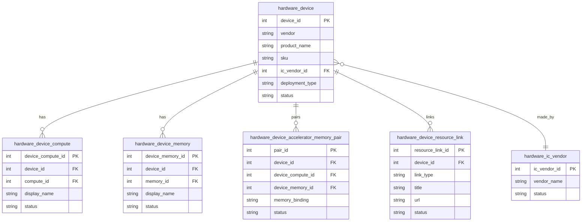

圖 11、Legacy 展示資料 ER 子圖。

圖後判讀時，`device_id` 固定舊硬體展示主體，`device_compute_id` 和 `device_memory_id` 分別保存舊展示使用的算力與記憶體項目，`pair_id` 保存算力與記憶體的搭配方式。`hardware_device_resource_link` 保存舊展示資源連結；若資料要進入正式維護，必須能對應到 `product`、`product_specification_option` 與 `product_resource_link` 的欄位模型。

## 查完這頁後應該留下什麼

查完這一頁後，平台維護者應該能指出問題屬於哪個資料功能域、哪個主體 ID 是起點、哪條外鍵或複合主鍵形成轉折，以及哪些狀態或時間欄位能支援目前判斷。若同一個問題無法在單一功能域內完成判讀，應以共同欄位銜接資料鏈，例如 `username` 連接帳號與群組、`product_specification_option_id` 連接產品規格與模型小卡、`card_id` 連接模型發布、模型目錄、方案內容與部署申請、`deployment_id` 連接部署申請與金鑰核發結果。
