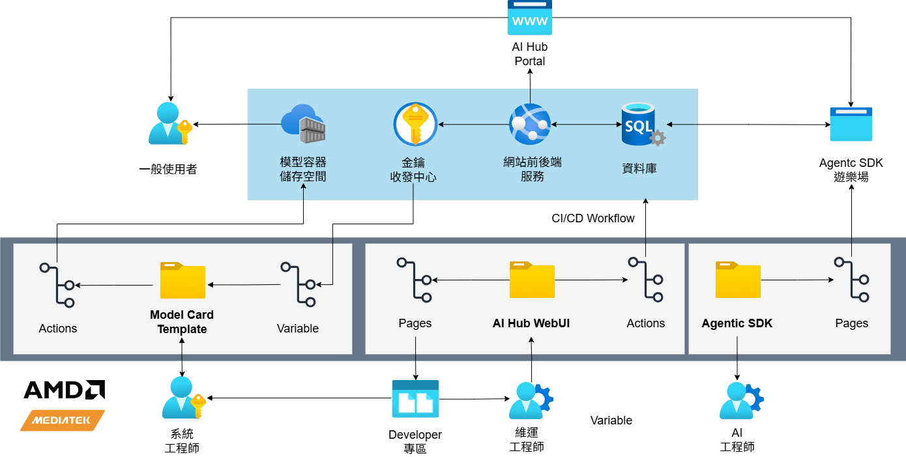

# 基礎架構介紹

## 這份文件會幫你完成什麼

當你是平台維護者，手上正在處理 WebUI 畫面、API endpoint、SQL 表名、workflow job、GitHub 設定、Azure 資源或使用者回報，並需要判斷這個訊號應該從哪一層開始追查時，就看這一頁。這一頁會先把維護訊號放回 AI Hub Portal 的介面層、應用服務層、資料層與基礎設施層，讓你能帶著正確的畫面、端點、資料表或 workflow 證據進入後續子頁。

這個章節會先固定平台本體四層，再用圖與入口表把四層對應到可觀察位置。介面層用來判斷使用者看見與操作的是哪一組頁面；應用服務層用來判斷畫面背後是哪一組 API 與服務流程；資料層用來確認正式資料、歷程與備份責任；基礎設施層用來確認 workflow、secret、Key Vault、Azure SQL、App Service 與正式雲端資源。後續四個子頁會分別展開單一層，讓同一個維護訊號可以沿著責任邊界繼續追查。

## 平台主體總覽

AI Hub 平台本體由介面層、應用服務層、資料層與基礎設施層構成。平台維護者先看問題最早出現在畫面、API、資料或雲端資源哪一層，再帶著同一個證據往後追查。這四層讓同一個維護訊號能從最早可觀察位置，追到可查證的頁面、端點、資料表或正式資源。

圖 1 固定平台本體四層的相對位置與分流判斷。平台維護者看圖時，先找手上的訊號最早出現在哪一層，再決定要從畫面、API、資料表或雲端資源哪個證據開始追查。這張圖只支援責任定位；頁面入口、API 分組、資料表責任與正式雲端資源的細節，仍由後續四個子頁展開。

*圖 1：AI Hub WebUI 平台架構總覽*

## 平台要維護哪些資源

這一節用來固定平台維護章節的四個閱讀入口。平台維護者先看自己手上拿到的是畫面、端點、資料表還是部署資源，再選擇要進入哪一層；每一層都對應一組觀察位置，也對應後面一頁專門展開的維護文件。

1. 介面層：手上是 WebUI 畫面、URL、模板檔案、頁面狀態或使用者回報時，先確認問題出現在哪一組頁面與入口。這一層用來把現象定位到公開區、個人工作區或管理區。
2. 應用服務層：手上是 API endpoint、HTTP 回應、服務流程結果或畫面背後的資料交換時，先確認哪一組 API 分組承接該畫面，以及服務端點在模型發布、部署授權、群組治理或代理執行中交換哪些資料。這一層幫維護者把畫面現象轉成可查的服務流程。
3. 資料層：手上是 SQL 表名、資料列、audit record、查詢結果或備份異常時，先確認正式資料由哪些主表、橋接表與歷程表承接，以及該資料是否還能對回原本的使用者、模型、方案、部署或治理事件。這一層幫維護者判斷資料責任與後續備份、還原或移植證據。
4. 基礎設施層：手上是 workflow job、GitHub Variables、GitHub Secrets、Key Vault secret、Azure SQL readiness、App Service endpoint 或 Azure 資源定位問題時，先確認正式環境由哪些 GitHub 與 Azure 主體支撐，以及部署流程會讀取或寫入哪些位置。這一層幫維護者把平台運作狀態對回可驗證的雲端資源。

這四層各自承接一組可觀察訊號。後面四個子頁會各自展開其中一層，平台維護者可以從手上的訊號切進單一主體層，再沿著同一層往下追頁面入口、API 分組、資料表責任或正式雲端資源。

## 這一頁固定了平台本體四層

完成這一頁後，平台維護者應能把手上的維護訊號分到 **介面層**、**應用服務層**、**資料層** 或 **基礎設施層**，並指出目前已掌握的畫面、端點、資料表或 workflow 證據。下一步是帶著同一組證據進入對應子頁，確認該層的入口、責任與完成條件。

## 接下來看哪一頁

這一節用來對照你手上的維護訊號應該切到哪一頁。先找最接近的訊號類型，再帶著同一個畫面、端點、資料表或 workflow 證據進入對應子頁。

| 手上的維護訊號 | 先看哪一頁 |
| --- | --- |
| WebUI 畫面、URL、模板檔案、頁面狀態或使用者回報 | [介面設計與使用流程](platform-interface-and-user-flows.md) |
| API endpoint、HTTP 回應、服務流程結果或畫面背後的資料交換 | [API 服務與端點邏輯](platform-services-and-business-processing.md) |
| SQL 表名、資料列、audit record、查詢結果或備份異常 | [資料庫結構與責任](database-structure-and-responsibility-boundaries.md) |
| workflow job、GitHub Variables、GitHub Secrets、Key Vault secret、Azure SQL readiness、App Service endpoint 或 Azure 資源定位問題 | [雲端部署資源](cloud-deployment-resources.md) |