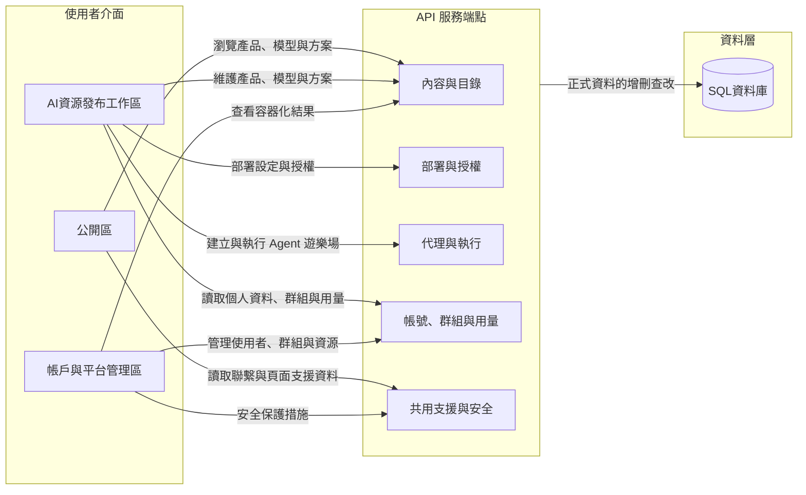

# API 服務與端點

## 這份文件會幫你完成什麼

AI Hub Portal 的 API 層，是 WebUI 操作、服務端點與後端資料狀態之間的責任邊界。平台維護者看見 WebUI 畫面出錯、流程沒有完成、使用者回報或後端異常時，先要判斷現象落在哪一組 API 服務責任，再依責任邊界回查端點、資料表或部署狀態。

API 層把 Portal 操作拆成三個查找情境：公開瀏覽 API 承接未登入使用者看到的產品、模型、方案與聯繫資訊；AI資源發布工作區 API 承接登入後的模型、方案、部署與代理操作；帳戶與平台管理 API 承接使用者、群組、資源與發布狀態的維運治理。這些情境共同形成 Portal 的服務入口；後續關係圖呈現畫面區域、API 服務群與 SQL 資料庫的相對關係，表格則把每組服務落到端點入口、可辨識線索與維護用途。

## 從網頁功能對照 API 端點

AI Hub Portal 的 API 拓撲，沿用 [介面設計與使用流程](platform-interface-and-user-flows.md) 定義的公開區、AI資源發布工作區與帳戶與平台管理區三個前端入口，先定位使用者操作，再經由內容與目錄、部署與授權、代理與執行、帳號群組與用量、共用支援與安全五組 API 服務承接端點責任，最後回到 SQL 資料庫確認正式資料狀態。圖 1 呈現畫面區域、API 服務群與 SQL 資料庫之間的相對關係；節點代表維護者定位問題時可使用的入口，線條代表畫面操作、端點責任與資料狀態之間的回查方向。這張圖只負責說明 Portal 操作如何接到服務與資料責任；實際 API 路徑、資料權威、部署狀態與故障判斷仍要用後續表格與各層文件確認。

圖 1、畫面區域、API 服務與 SQL 資料庫關係。

後續五組 API 表格對應 Portal 中五種被維護的服務對象：內容與目錄、部署與授權、帳號群組與用量、代理與執行、共用支援與安全。進入表格前，先準備畫面區域、URL 或操作名稱、使用者回報內容、API 回應或後端紀錄，用這些線索縮小 API 服務群與端點範圍。表格只壓縮端點入口、主要辨識內容、資料來源與維護用途；真正的判斷在於理解同一個操作如何從 WebUI 畫面接到 API 端點，再接到 SQL 資料狀態或下一個維護頁。

## API 服務分組

平台維護者進到 API 服務分組時，通常已經看到一個畫面異常、URL、使用者回報、API 回應或後端紀錄。先用這些線索判斷操作落在內容、部署、代理、治理或共用支援哪一組服務，再用表格查方法、端點、處理內容與輸出結果。若現象跨越單一業務 API，例如登入、錯誤格式、表單檢查或外部 Playground 連線問題，則回到「共用支援與安全」確認請求來源與安全保護狀態。

### 內容與目錄

內容與目錄服務從公開區的 **瀏覽產品、模型與方案** 開始。使用者在產品目錄、模型小卡或方案頁看到的內容，都要能回到公開產品、模型卡與方案資料；登入後，維護者或內容提供者再透過 **維護產品、模型與方案** 更新產品、模型上架資料與方案內容；帳戶與平台管理區則用模型清單確認容器化結果是否已回寫到同一張模型小卡。表 1 把這條內容主線拆成可回查的 API 入口，維護者可以從正在出錯的畫面或操作，對到讀取、建立、更新、刪除、發布憑證匯出或結果回寫端點。

| 方法 | 端點 | 處理內容 | 輸出結果 |
| --- | --- | --- | --- |
| GET | /api/model-cards | 讀取公開模型小卡清單與篩選結果。 | 公開模型清單與部署入口可看到可用模型。 |
| GET | /api/products | 讀取公開產品、供應商與硬體規格摘要。 | 公開產品展示與產品篩選結果可看到產品資料。 |
| GET | /api/admin/products | 讀取管理端產品清單。 | 產品管理畫面可看到可維護的產品資料。 |
| POST | /api/admin/products | 建立管理端產品。 | 產品管理畫面會出現新產品資料。 |
| GET | /api/admin/products/<product_id> | 讀取指定管理端產品。 | 產品管理畫面可看到指定產品資料。 |
| PUT | /api/admin/products/<product_id> | 更新指定管理端產品。 | 產品管理畫面會反映更新後的產品資料。 |
| DELETE | /api/admin/products/<product_id> | 刪除指定管理端產品。 | 產品管理畫面不再列出該產品。 |
| POST | /api/admin/products/<product_id>/image | 更新指定產品圖片。 | 產品展示或管理畫面會顯示更新後圖片。 |
| PUT | /api/admin/products/<product_id>/details | 更新指定產品詳情頁內容。 | 產品展示或管理畫面會反映更新後產品資料。 |
| PUT | /api/admin/products/<product_id>/resource-links | 更新指定產品資源連結。 | 產品展示或管理畫面會反映更新後資源連結。 |
| GET | /api/me/tools | 讀取目前登入帳號的方案清單。 | AI資源發布工作區可看到使用者已建立的方案。 |
| POST | /api/me/tools | 建立目前登入帳號的方案資料。 | AI資源發布工作區會出現新方案，並可接續編輯內容。 |
| POST | /api/me/tools/upload | 從上傳內容建立方案資料。 | AI資源發布工作區會保存匯入後的方案資料。 |
| GET | /api/me/tools/<tool_id> | 讀取指定方案資料。 | 方案編輯頁可看到同一筆方案內容。 |
| PUT | /api/me/tools/<tool_id> | 更新指定方案的中繼資料。 | 方案清單與方案頁會反映更新後的名稱、說明或狀態。 |
| GET | /api/me/tools/<tool_id>/display | 讀取指定方案的展示內容。 | 方案展示頁可看到要公開或呈現的內容。 |
| PUT | /api/me/tools/<tool_id>/display | 更新指定方案的展示內容。 | 方案展示頁會反映更新後的頁面內容。 |
| POST | /api/me/tools/<tool_id>/thumbnail | 更新指定方案縮圖。 | 方案清單或方案頁會顯示更新後的縮圖。 |
| GET | /api/me/tools/<tool_id>/assets/<path:filename> | 讀取指定方案的圖片資產。 | 方案頁可載入對應圖片。 |
| DELETE | /api/me/tools/<tool_id> | 刪除指定方案。 | AI資源發布工作區不再列出該方案。 |
| PUT | /api/solutions/<slug> | 更新公開方案內容。 | 公開方案頁會反映更新後的方案資料。 |
| POST | /api/solutions/<slug>/image | 更新公開方案圖片。 | 公開方案頁會顯示更新後的方案圖片。 |
| GET | /api/me/model-cards | 讀取目前登入帳號建立的模型小卡資料。 | 我的模型畫面可看到已建立的模型上架資料。 |
| POST | /api/me/model-cards | 建立模型小卡，並固定部署裝置、模型架構與 OpenAI SDK 支援資訊。 | 我的模型畫面會出現新模型小卡，並可匯出發布憑證。 |
| GET | /api/me/model-cards/<card_id> | 讀取指定模型小卡。 | 我的模型畫面可看到同一筆模型上架資料。 |
| PUT | /api/me/model-cards/<card_id> | 更新指定模型小卡的上架資料。 | 我的模型畫面會反映更新後的部署裝置、模型架構或 SDK 支援資訊。 |
| DELETE | /api/me/model-cards/<card_id> | 刪除指定模型小卡。 | 我的模型畫面不再列出該筆模型小卡。 |
| POST | /api/me/model-cards/<card_id>/export-yaml | 匯出指定模型小卡的 `model_card.yaml` 發布憑證。 | 模型發布方取得可放入 GitHub 範例程式庫的發布憑證。 |
| POST | /api/model-card-publish/callback | 接收 CI/CD 自動交付流程的結果回寫資料。 | 同一張模型小卡會更新 `sdk_used` 與 `registry_location`。 |

表 1、內容與目錄。

### 部署與授權

部署與授權服務接在模型與產品資料之後。使用者進入 **部署設定與授權** 時，部署頁會讀取可用模型、部署目標與執行設定。維護者查部署問題時，先用表 2 確認部署頁取得哪些選項與環境設定；授權、金鑰與容器啟用結果再交給模型金鑰與授權頁確認。

| 方法 | 端點 | 處理內容 | 輸出結果 |
| --- | --- | --- | --- |
| GET | /api/deployment-config | 讀取部署頁需要的部署選項與環境設定來源。 | 部署頁可看到部署選項與環境設定來源；需要查授權、金鑰或容器啟用資料時，接到模型金鑰與授權頁確認。 |
| GET | /api/model-cards | 讀取部署入口可選的模型小卡。 | 部署頁可用模型名稱或版本接續查模型金鑰與授權內容。 |

表 2、部署與授權。

### 帳號、群組與用量

帳號、群組與用量服務把 AI資源發布工作區和帳戶與平台管理區接起來。登入使用者透過 **讀取個人資料、群組與用量** 看到自己的帳號、群組、Budget / Credit 與資產摘要；管理者再透過 **管理使用者、群組與資源** 維護使用者角色、群組關係與跨帳號資源狀態。表 3 讓維護者從帳號、群組或資產摘要回查 API，若問題出在權限、角色、群組成員或用量統計，先確認畫面上的使用者與群組，再對到表格中的端點。

| 方法 | 端點 | 處理內容 | 輸出結果 |
| --- | --- | --- | --- |
| GET | /api/me | 讀取目前登入帳號、顯示名稱、角色與狀態。 | AI資源發布工作區與帳戶與平台管理區可辨識目前登入者。 |
| POST | /api/me/profile | 更新目前登入帳號的個人資料。 | 個人資料畫面會反映更新後的顯示名稱與帳號狀態。 |
| POST | /api/me/password | 更新目前登入帳號的密碼。 | 密碼更新結果會回到個人帳戶操作。 |
| GET | /api/me/groups | 讀取目前登入帳號所屬群組。 | AI資源發布工作區可看到群組關係與群組監測摘要。 |
| GET | /api/me/score | 讀取目前登入帳號的 Budget / Credit 與額度摘要。 | 個人帳戶或資源摘要可看到用量數字。 |
| GET | /api/group-management | 讀取可管理群組、目錄使用者與建立權限。 | 群組管理頁可看到管理者能操作的群組與成員候選清單。 |
| GET | /api/admin/groups/<group_id>/monitoring | 讀取指定群組監測資料。 | 帳戶與平台管理區可看到指定群組的資源與用量摘要。 |
| POST | /api/group-management/groups | 建立群組。 | 群組管理頁會出現新群組。 |
| POST | /api/group-management/groups/<group_id>/members | 新增指定群組成員。 | 群組成員名單會新增該帳號。 |
| DELETE | /api/group-management/groups/<group_id>/members/<username> | 移除指定群組成員。 | 群組成員名單不再列出該帳號。 |
| DELETE | /api/group-management/groups/<group_id> | 封存指定群組。 | 群組管理頁會反映群組封存結果。 |
| GET | /api/admin/users | 讀取平台使用者清單。 | 使用者管理頁可看到可管理帳號。 |
| GET | /api/admin/users/<username> | 讀取指定使用者詳細資料。 | 使用者管理頁可看到指定帳號的角色、狀態與資產摘要。 |
| POST | /api/admin/users/<username>/role | 更新指定使用者角色。 | 使用者管理頁會反映更新後的角色。 |
| POST | /api/admin/users/<username>/status | 更新指定使用者狀態。 | 使用者管理頁會反映啟用、停用或其他狀態。 |
| DELETE | /api/admin/users/<username> | 刪除或停用指定使用者。 | 使用者管理頁不再把該帳號列為可正常使用帳號。 |

表 3、帳號、群組與用量。

### 代理與執行

代理與執行服務承接使用者在工作區 **建立與執行 Agent 遊樂場** 的操作。使用者看到的是 Agent 清單、外部 Playground 入口、執行狀態或串流輸出；維護者要確認的是工作區端點與外部 Playground 是否指向同一筆 Agent、同一次執行紀錄。表 4 把工作區 API 和外部 Playground 入口分開列出，當清單、啟動、執行或串流結果異常時，維護者可以先看問題停在哪一側，再決定要查本地資料或外部執行回應。

| 方法 | 端點 | 處理內容 | 輸出結果 |
| --- | --- | --- | --- |
| POST | /api/me/agent-workspace-bridge | 建立工作區到外部 Playground 的連線權杖。 | 外部 Playground 可用連線權杖讀取或操作對應 Agent。 |
| GET | /api/me/agents | 讀取目前登入帳號的 Agent 清單。 | AI資源發布工作區可看到已建立的 Agent。 |
| POST | /api/me/agents | 建立 Agent 定義。 | AI資源發布工作區會出現新 Agent。 |
| GET | /api/me/agents/<agent_id> | 讀取指定 Agent 定義。 | Agent 編輯或詳情畫面可看到同一筆 Agent。 |
| PUT | /api/me/agents/<agent_id> | 更新指定 Agent 定義。 | Agent 編輯或詳情畫面會反映更新後內容。 |
| PUT | /api/me/agents/<agent_id>/gallery-type | 更新指定 Agent 的 Gallery 類型。 | 我的遊樂場清單會反映無分類、智慧大健康或智慧工廠次系統；無分類不會出現在公開 Gallery。 |
| PUT | /api/me/agents/<agent_id>/use-case | 更新指定公開 Agent 的使用案例內容。 | 公開 Agent 詳情頁會反映更新後的使用案例內容。 |
| DELETE | /api/me/agents/<agent_id> | 刪除指定 Agent。 | AI資源發布工作區不再列出該 Agent。 |
| POST | /api/me/agents/<agent_id>/run | 執行指定 Agent。 | 系統會建立執行紀錄並回傳結果讀取入口。 |
| GET | /api/me/agents/<agent_id>/runs/<workflow_id>/result | 讀取指定執行紀錄的結果。 | AI資源發布工作區可看到該次執行結果。 |
| GET | /api/me/agents/<agent_id>/runs/<workflow_id>/stream | 讀取指定執行紀錄的串流輸出。 | AI資源發布工作區可接收該次執行的串流內容。 |
| GET | /api/agent-workspace-bridge/agents | 讓外部 Playground 讀取連線帳號的 Agent 清單。 | 外部 Playground 可看到同一組 Agent。 |
| POST | /api/agent-workspace-bridge/agents | 讓外部 Playground 建立 Agent。 | 工作區與外部 Playground 可看到新 Agent。 |
| GET | /api/agent-workspace-bridge/agents/<agent_id> | 讓外部 Playground 讀取指定 Agent。 | 外部 Playground 可看到指定 Agent 定義。 |
| PUT | /api/agent-workspace-bridge/agents/<agent_id> | 讓外部 Playground 更新指定 Agent。 | 工作區與外部 Playground 會反映更新後 Agent。 |
| DELETE | /api/agent-workspace-bridge/agents/<agent_id> | 讓外部 Playground 刪除指定 Agent。 | 工作區與外部 Playground 不再列出該 Agent。 |
| POST | /api/agent-workspace-bridge/agents/<agent_id>/run | 讓外部 Playground 執行指定 Agent。 | 系統會建立執行紀錄並回傳外部 Playground 可讀取的結果入口。 |
| GET | /api/agent-workspace-bridge/agents/<agent_id>/runs/<workflow_id>/result | 讓外部 Playground 讀取指定執行結果。 | 外部 Playground 可看到該次執行結果。 |
| GET | /api/agent-workspace-bridge/agents/<agent_id>/runs/<workflow_id>/stream | 讓外部 Playground 讀取指定執行串流。 | 外部 Playground 可接收該次執行的串流內容。 |
| POST | /api/playground/auth/verify | 驗證外部 Playground 送來的 AI Hub 帳密，並回傳帳戶顯示名稱。 | Playground 可建立手動登入 session，Runner 問候可優先使用 `display_name`。 |
| POST | /api/playground/handoff/verify | 驗證 AI Hub 短效 handoff token。 | Playground 可建立 Builder 或 Runner session，並取得 `username`、`agent_id` 與 `display_name`。 |
| POST | /api/playground/agents/<agent_id>/config/public/load | 讀取已公開 Agent 的 Playground 設定。 | 公開唯讀 Runner 可在未登入狀態載入 Agent config。 |

表 4、代理與執行。

### 共用支援與安全

共用支援與安全服務處理跨頁面的支援資料與保護機制。公開聯繫頁、部署頁支援資料與產品表單引用的硬體規格欄位，會透過 **讀取聯繫與頁面支援資料** 取得；登入狀態、站內表單檢查、角色權限與外部 Playground 連線則落在 **安全保護措施**。當 API 請求失敗時，維護者再用固定錯誤格式中的 code、message 與 reason 判斷錯誤類型，確認是登入、權限、輸入檢查、資料來源或外部連線問題。

| 方法 | 端點 | 處理內容 | 輸出結果 |
| --- | --- | --- | --- |
| GET | /api/me | 讀取目前登入帳號與角色狀態。 | 維護者可確認請求是否帶入有效登入狀態。 |
| POST | /api/me/profile | 更新目前登入帳號資料，並套用登入與站內寫入保護。 | 個人資料更新結果可用來確認站內寫入保護是否通過。 |
| POST | /api/me/password | 更新目前登入帳號密碼，並套用登入與站內寫入保護。 | 密碼更新結果可用來確認敏感寫入是否通過安全檢查。 |
| GET | /api/platform/contact-channels | 讀取平台聯繫管道。 | 聯繫頁可看到平台維護者設定的聯繫資訊。 |
| PUT | /api/platform/contact-channels | 更新平台聯繫管道。 | 聯繫頁會反映更新後的聯繫資訊，並可確認管理權限與站內寫入保護。 |
| GET | /api/deployment-config | 讀取部署頁支援資料。 | 部署頁可看到部署選項與環境設定來源。 |
| GET | /api/hardware-specs/compute | 讀取硬體 AI 算力規格選項。 | 產品管理畫面可載入算力規格欄位。 |
| POST | /api/hardware-specs/compute | 建立硬體 AI 算力規格選項。 | 產品管理畫面可使用新增的算力規格。 |
| GET | /api/hardware-specs/memory | 讀取硬體記憶體規格選項。 | 產品管理畫面可載入記憶體規格欄位。 |
| POST | /api/hardware-specs/memory | 建立硬體記憶體規格選項。 | 產品管理畫面可使用新增的記憶體規格。 |
| POST | /api/me/agent-workspace-bridge | 發放外部 Playground 連線權杖。 | 外部 Playground 可用權杖進入受保護的 Agent 對應入口。 |

表 5、共用支援與安全。

## Legacy API 相容對照

產品主體現在統一用 products 命名。維護者看到舊的 hardware-atlas、me/devices 或 /api/hardware 路徑時，用表 6 對回正式 products 端點；產品表單引用的硬體規格字典仍保留 `hardware-specs` 命名。API 服務分組中的主表以正式端點為準，legacy 端點只用來判讀既有呼叫與過渡紀錄。

| Legacy 端點 | 正式端點 | 正式主體 | 相容狀態 |
| --- | --- | --- | --- |
| GET /api/hardware-atlas | GET /api/products | 產品目錄 | 後端保留 legacy alias，正式呼叫改用 products 端點。 |
| GET /api/me/devices | GET /api/admin/products | 管理端產品清單 | 後端保留 legacy alias，正式呼叫改用 products 端點。 |
| POST /api/me/devices | POST /api/admin/products | 建立管理端產品 | 後端保留 legacy alias，正式呼叫改用 products 端點。 |
| GET /api/me/devices/<product_id> | GET /api/admin/products/<product_id> | 指定管理端產品 | 後端保留 legacy alias，正式呼叫改用 products 端點。 |
| PUT /api/me/devices/<product_id> | PUT /api/admin/products/<product_id> | 更新指定管理端產品 | 後端保留 legacy alias，正式呼叫改用 products 端點。 |
| DELETE /api/me/devices/<product_id> | DELETE /api/admin/products/<product_id> | 刪除指定管理端產品 | 後端保留 legacy alias，正式呼叫改用 products 端點。 |
| POST /api/hardware/<product_id>/image | POST /api/admin/products/<product_id>/image | 指定產品圖片 | 後端保留 legacy alias，正式呼叫改用 products 端點。 |
| PUT /api/hardware/<product_id> | PUT /api/admin/products/<product_id>/details | 指定產品詳情 | 後端保留 legacy alias，正式呼叫改用 products 端點。 |
| PUT /api/hardware/<product_id>/resource-links | PUT /api/admin/products/<product_id>/resource-links | 指定產品資源連結 | 後端保留 legacy alias，正式呼叫改用 products 端點。 |

表 6、Legacy API 相容對照。

## 查完這頁後應該留下什麼

查完這一頁後，平台維護者應該能把畫面問題整理成相鄰層可以接手的 API 證據：問題出現在哪個畫面、要看哪個 API 端點、畫面上要比對哪個名稱或帳號、API 回應或結果出現在哪裡，以及下一步要交給哪一層確認。請用下列清單確認資訊是否足夠接到下一頁。

1. 內容與目錄：留下模型上架資料、`model_card.yaml` 發布憑證、結果回寫資料、模型清單顯示結果，以及公開頁看到的模型或方案內容。
2. 部署與授權：留下部署頁讀到的選項、可用模型結果、部署目標、模型名稱或版本，讓後續授權相關頁面可以確認金鑰、授權或容器啟用結果。
3. 帳號、群組與用量：留下目前登入帳號、指定帳號或畫面上的群組，並對到個人資料、群組資料、角色狀態、Budget / Credit、額度摘要與操作紀錄。
4. 代理與執行：留下 Agent 項目、外部 Playground 連線、執行紀錄、執行結果與串流讀取狀態。
5. 共用支援與安全：留下錯誤格式、Session、CSRF、外部 Playground 連線權杖，以及支援資料對應到哪個畫面或 API。

若問題需要確認正式資料表、關聯資料或歷程紀錄，帶著 API 端點、畫面上的名稱或帳號，以及 API 回應結果，接到 [資料庫結構與責任](database-structure-and-responsibility-boundaries.md) 確認資料責任。
