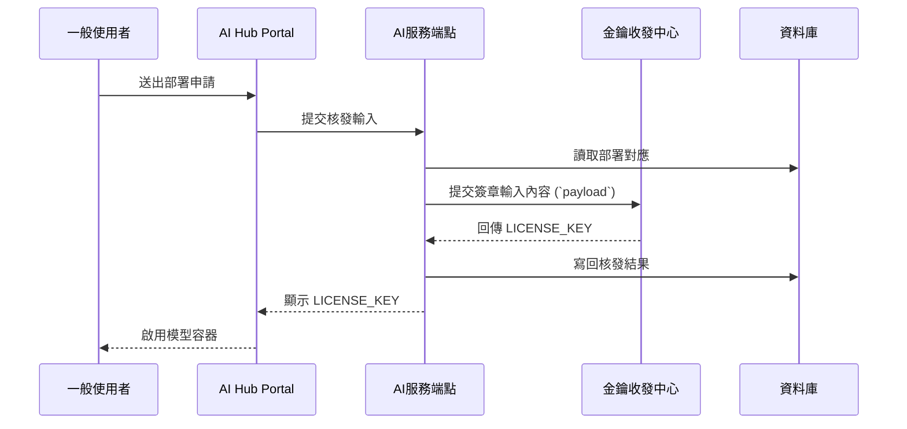

# 模型金鑰與授權

## 這份文件會幫你完成什麼

這份文件定義 AI Hub 如何處理部署申請所涉及的模型金鑰與授權資料，並說明這些處理結果如何成為部署紀錄，並保留後續查證與交付所需的對應關係。平台維護者可以從一般使用者在 AI Hub Portal 的 **我的部署 > 新增部署** 送出申請這個起點開始，往下確認平台如何依部署目標、使用月數與主機識別資訊，建立綁定系統、追蹤用量的授權機制，直到取得**啟用金鑰**（`LICENSE_KEY`）為止。

這個章節會從核發處理與授權落地追蹤兩個面向，說明模型金鑰核發在 AI Hub 內部是怎麼進行的。平台收到部署申請後，會先整理成部署紀錄，再整理成可送簽的正式授權內容，最後交付為啟用金鑰（`LICENSE_KEY`）。接下來會先說明平台怎麼接收部署申請、整理授權內容，再說明核發結果怎麼寫回系統，並成為後續容器啟用與部署結果查證的依據。

## 主流程總覽

部署申請會依序經過 AI Hub Portal、AI服務端點、金鑰收發中心與資料庫。平台收到申請資料後，會先整理成部署紀錄，再整理成正式授權內容，接著準備送簽時使用的簽章輸入內容（`payload`）並完成簽章，最後產生啟用金鑰並寫回部署結果，保留後續交付與查證所需的對應關係。圖 1 只用來看平台如何承接一般使用者送出的部署申請，不取代後續各階段的處理細節。

圖 1、AI Hub Portal、AI服務端點、金鑰收發中心與資料庫 之間的責任交接順序。

圖 1 固定部署申請在 Portal、AI服務端點、金鑰收發中心與資料庫之間的交接順序。平台維護者讀完這張圖後，先確認申請資料會被整理成正式授權內容，核發結果會回到部署清單，後續再依要查的問題進入金鑰核發或授權內容頁。

## 平台要維護哪些資源

這一節用來對照模型金鑰與授權主線中，各個平台主體各自要維護哪些內容：

1. AI Hub Portal：承接部署申請入口與核發結果顯示，負責收集部署目標、使用月數與主機識別資訊，並在核發完成後顯示對應的啟用金鑰（`LICENSE_KEY`）。
2. AI服務端點：承接核發處理，負責接收核發輸入、讀取部署對應、整理授權條件、組裝簽章輸入內容（`payload`）、寫回核發結果，並用秘密參照（`secret reference`）連到後續容器取用的授權內容。
3. 金鑰收發中心：承接簽章處理，負責保管私鑰與簽章材料、接收簽章要求、產生簽章值（`signature`）、金鑰版本（`key_version`）與啟用金鑰（`LICENSE_KEY`）。簽章材料固定保留在金鑰收發中心，由該中心完成簽章後回傳核發結果。
4. 資料庫：承接部署申請對應、核發時間基準、核發結果與後續查證所需紀錄，負責保存部署紀錄、授權摘要，以及後續交付與查證所需資料。

上述四個資源共同完成部署申請、授權整理、簽章與交付。要查平台如何完成核發與交付結果，進入[金鑰核發流程](license-issuance.md)；要查正式授權內容包含哪些欄位、欄位如何形成與使用，進入[系統綁定與授權內容](license-condition-formation.md)。

## 接下來看哪一頁

這一節用來對照目前要確認的是哪一段處理內容，供平台維護者快速對照目前應查看的內容：

| 接下來要看的內容 | 對應頁面 |
| --- | --- |
| 部署資料建檔、簽章交接、核發結果寫回與交付 | [金鑰核發流程](license-issuance.md) |
| 部署資料、授權期限與系統綁定如何形成正式授權欄位 | [系統綁定與授權內容](license-condition-formation.md) |