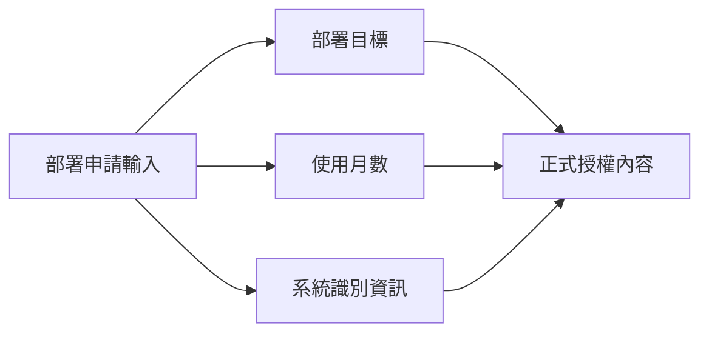

# 系統綁定與授權內容

## 這份文件會幫你完成什麼

當平台需要確認系統綁定與授權內容如何被整理成**正式授權內容**，並理解這份正式授權內容的欄位、形成方式與後續用途時，就看這一頁。

這一頁會先定義正式授權內容包含哪些欄位，再說明部署目標、使用月數與系統識別資訊如何形成這些欄位，最後收束到這份正式授權內容如何進入後續簽章與驗章。

## 正式授權內容由哪些欄位組成

[金鑰核發流程](license-issuance.md) 會產生這一頁定義的正式授權內容。這份內容由部署目標識別值（`card_id`）、核發時間（`issued_at`）、到期時間（`expires_at`）與主機綁定結果（`hardware_hash`）四個欄位組成。

```text
{
  card_id: <部署目標識別值>,
  issued_at: <核發時間>,
  expires_at: <到期時間>,
  hardware_hash: <主機綁定結果>
}
```

表 1 整理正式授權內容的欄位、來源輸入與後續用途。讀者可先用表格確認欄位範圍，再回到後面三個小節查看各欄位如何形成。

| 正式欄位 | 來源輸入 | 後續用途 |
| --- | --- | --- |
| 部署目標識別值 (`card_id`) | 部署目標 | 連回部署紀錄與交付內容核對 |
| 核發時間 (`issued_at`) | 核發時間 | 作為核發與查證時間基準 |
| 到期時間 (`expires_at`) | 使用月數、核發時間 | 作為過期判定基準 |
| 主機綁定結果 (`hardware_hash`) | 系統識別資訊 | 比對執行系統是否與授權綁定一致 |

表 1、正式授權內容的欄位定義、來源與用途。

## 各欄位如何形成

接下來會依三條路徑往下看：先看部署目標如何形成 `card_id`；再看使用月數如何形成 `issued_at` 與 `expires_at`；最後看系統識別資訊如何形成 `hardware_hash`。這三類來源資料會先整理成正式授權內容，後續再轉成送簽時使用的簽章輸入內容。

圖 1 整理部署目標、使用月數與系統識別資訊如何收進同一份正式授權內容。讀圖時先確認三類來源資料最後收斂到同一份內容；欄位定義仍以表 1 為準，各欄位形成方式由後面三個小節說明。



圖 1、三類來源資料收斂為同一份正式授權內容。

### 部署目標如何形成 `card_id`

表 1 中的部署目標識別值 (`card_id`)，是把部署目標固定成單一模型對應後得到的正式欄位。這一節的重點是確認部署申請中的部署目標，後面都會用同一個欄位來記錄、核發與核對。

### 使用月數如何形成 `issued_at` 與 `expires_at`

表 1 中的核發時間 (`issued_at`) 與到期時間 (`expires_at`)，是把使用月數與核發當下的正式時間整理成同一組期限結果後得到的正式欄位。`issued_at` 固定本次授權建立時點，`expires_at` 則以使用月數為來源推得失效時間，讓後續保存、簽章與容器端過期判斷共同依附同一組期限結果。

### 系統識別資訊如何形成 `hardware_hash`

表 1 中的主機綁定結果 (`hardware_hash`)，是把系統識別資訊整理成可重新計算、重新比對的系統綁定資料後得到的正式欄位。這樣後續保存、簽章與容器端裝置一致性判斷就都會使用同一個固定結果。

## 正式授權內容完成後要保證什麼

走到這裡，前面的內容已經完成正式欄位定義與形成方式說明。接下來要確認的，是這份正式授權內容在進入後續簽章與驗章前，是否持續維持同一份內容。

1. 部署目標、使用月數與系統識別資訊形成的結果，必須先收進同一份正式授權內容。
2. 後續簽章與驗章，必須共同依附這同一份正式授權內容。

當部署目標、期限與主機綁定結果都收進同一份正式授權內容後，平台就能把這份內容交給後續簽章流程。後續金鑰核發會再把它轉成簽章輸入內容（`payload`），並封裝為啟用金鑰（`LICENSE_KEY`）。