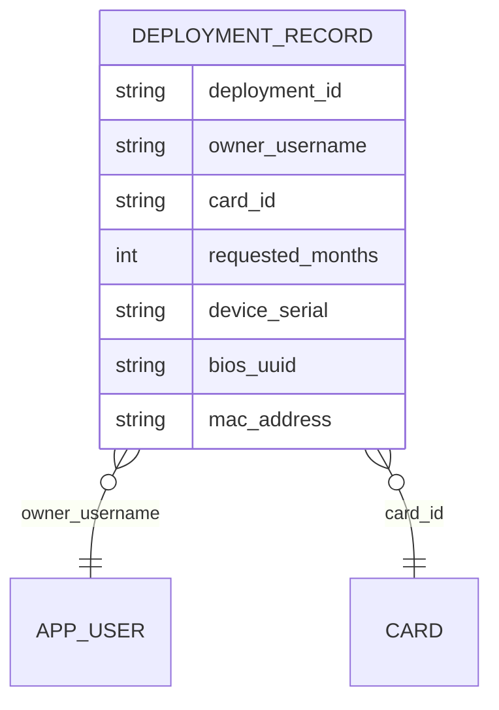
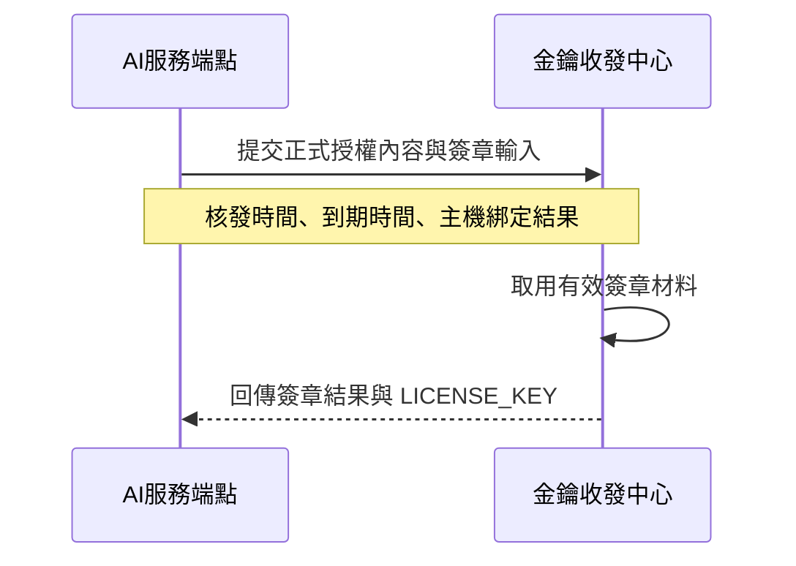
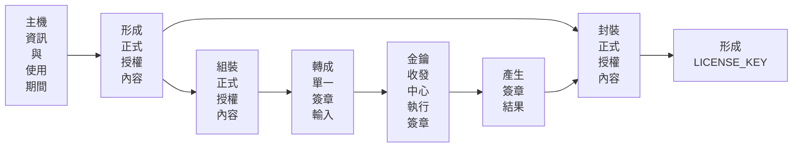

# 金鑰核發流程

## 這份文件會幫你完成什麼

這份文件定義 AI Hub 如何處理部署申請所涉及的模型金鑰與授權資料，並說明這些處理結果如何成為部署紀錄，並保留後續查證與交付所需的對應關係。平台維護者可以從一般使用者在 AI Hub Portal 的 **我的部署 > 新增部署** 送出申請這個起點開始，往下確認平台如何依部署目標、使用月數與主機識別資訊，建立綁定系統、追蹤用量的授權機制，直到取得**啟用金鑰**（`LICENSE_KEY`）為止。

這個章節將從核發處理與授權落地追蹤兩個面向，說明模型金鑰核發在 AI Hub 內部的實作內容。部署申請是整個核發流程的起點，平台在接收後會先整理成部署紀錄，再組成正式授權內容，最後交付為啟用金鑰（`LICENSE_KEY`）。首先，說明部署申請如何被接收、整理並組裝為可送簽的**正式授權內容**，以及這些內容如何支撐部署對應固定、主機綁定與用量追蹤等授權要求；其次，說明核發結果如何寫回系統、保留交付對應，並成為後續容器啟用與部署結果查證所依據的紀錄。

## 平台如何完成金鑰核發

接下來的各節會依序說明平台如何接收部署申請、建立部署紀錄、形成正式授權內容、完成簽章，並把核發結果交付給容器啟用流程。

### 接收申請與資料建檔

平台承接部署申請時，會先收下一般使用者在 AI Hub Portal 提供的部署目標、欲使用月數與主機識別資訊，並把本次申請登記成一筆可核發、可查證的部署紀錄。這筆紀錄會保存申請者、部署目標、使用期間與主機識別來源，讓後續授權內容形成、簽章與交付都能回到同一筆部署結果。

圖 2 整理單筆部署紀錄寫入資料庫時需要保存的欄位與關聯。讀圖時先確認同一筆紀錄同時保存申請者、部署目標、使用月數與主機識別資訊；這些資料會在後續形成正式授權內容時被取用。

圖 2、單筆部署紀錄寫入資料庫時的預期欄位結構。

部署紀錄建立後，後續流程使用的是同一筆已保存的部署結果。平台會以這筆紀錄固定申請者、部署目標與使用月數；完成核發時，再記錄核發時間並推導到期時間，作為授權內容與後續查證的時間基準。主機識別資訊會以裝置序號、BIOS 識別碼與網卡位址保存，讓平台後續能回到原始來源重新確認綁定依據。進入授權條件形成時，平台再用固定規則整理這三項資訊，產生正式授權內容中的主機綁定結果（`hardware_hash`）。

### 授權機制與數位簽章

在部署對應與核發原料都已固定之後，處理流程就會從申請承接轉入授權機制與數位簽章。平台會先把正式授權內容整理好，再轉成送簽時使用的簽章輸入內容。完成簽章後，啟用金鑰（`LICENSE_KEY`）就會交付給容器。AI服務端點會把這份正式授權內容送到金鑰收發中心；金鑰收發中心會使用目前有效的簽章材料完成簽章，再把結果回傳給 AI服務端點，讓這筆部署處理流程進入正式核發階段。

圖 3 整理 AI服務端點與金鑰收發中心之間的簽章交接順序，讓讀者直接對照簽章往返的責任分工。

圖 3、AI服務端點與金鑰收發中心之間的簽章交接順序。

送入圖 3 所示簽章交接的正式授權內容，會先由平台依本次部署所識別出的主機資訊與這筆申請確認的使用期間，形成後續授權核發與容器啟用都必須依附的正式條件。依目前授權機制，真正進入這份正式授權內容的核心條件，是**核發時間**、**到期時間**與**主機綁定結果**。平台會先記錄本次核發時間，再依使用月數推導到期時間，並將裝置序號、BIOS 識別碼與網卡位址三項主機識別資訊收斂為單一主機綁定結果。這些內容在進入簽章程序之前，就已經從部署表單輸入轉成正式授權內容。如表 1 所示，這一層只處理授權內容的來源與形成結果，不處理容器端稍後如何驗證。

| 正式授權內容 | 來源 | 在授權中的角色 |
| --- | --- | --- |
| 核發時間 (`issued_at`) | 平台核發當下的正式時間 | 提供授權建立時點 |
| 到期時間 (`expires_at`) | 核發時間與使用月數 | 提供期限判定基準 |
| 主機綁定結果 (`hardware_hash`) | 裝置序號、BIOS 識別碼、網卡位址 | 提供裝置一致性判定基準 |

表 1、正式授權內容中的時間與主機條件。

當這些條件都已固定後，AI服務端點會先將這些內容組裝為同一份正式授權內容[1](license-condition-formation.md)，再轉成單一簽章輸入，送入金鑰收發中心。這代表簽章保護的是本次核發當下整理好的整份正式授權內容。只要其中任一條件在核發後被改動，不論是主機綁定結果、核發時間，還是到期時間，原本依這份內容產生的簽章結果就不會再對應同一筆正式授權。圖 4 整理正式授權內容形成 `LICENSE_KEY` 的順序，讓讀者直接對照資料形成、簽章與封裝的處理步驟。

圖 4、正式授權內容形成 `LICENSE_KEY` 的處理順序。

這一步完成後，金鑰收發中心會回傳已完成簽章、可進入容器啟用流程的啟用金鑰（`LICENSE_KEY`）。平台核發完成後，會將這份啟用金鑰顯示在部署清單中；一般使用者看到金鑰時，就能接續執行容器啟用。

模型容器接收到啟用金鑰（`LICENSE_KEY`）後，會先在本地完成真偽檢查，確認授權內容確實由平台核發，讓容器直接在本地判斷授權來源。這一步成立後，容器才會繼續進入裝置檢查與過期檢查。裝置檢查會依目前執行現場重新讀取裝置資訊，按照與核發端相同的整理與計算規則，重新算出主機綁定結果，再與 `LICENSE_KEY` 內保存的主機綁定值比對；過期檢查則會以當前時間確認授權是否已失效。這三段啟用檢查的使用輸入與驗證目的如表 2 所示，核發端欄位形成方式則由前面的授權內容段落說明。

| 容器端驗證階段 | 使用的輸入 | 驗證目的 |
| --- | --- | --- |
| 真偽檢查 | `LICENSE_KEY` 內的授權內容與簽章結果 | 確認授權由平台核發 |
| 裝置檢查 | 目前裝置資訊與 `LICENSE_KEY` 內的主機綁定值 | 確認執行主機與核發對象一致 |
| 過期檢查 | 當前時間與 `LICENSE_KEY` 內的到期時間 | 確認授權尚未失效 |

表 2、模型容器啟用時的驗證階段。

因此，數位簽章在這一段會完成兩件事：平台產生啟用金鑰（`LICENSE_KEY`），也把核發當下已固定的主機條件與期限條件整理成不可任意竄改的正式授權內容。這樣模型容器不用回平台查詢，也能在本地完成真偽確認、裝置比對與到期判斷。後續持久化、交付與容器啟用，看的都是同一份已固定、已簽章、且可在本地驗證的正式授權結果。

## 核發結果寫入後要保證什麼

走到這裡，前面已經完成部署紀錄建檔、正式授權內容固定，以及 `LICENSE_KEY` 簽章。接下來要確認的，就是這些結果如何被留存、交付，並在容器啟用時持續成立。

持久化與交付這一段真正要保證兩件事：

1. 顯示於部署清單中的啟用金鑰（`LICENSE_KEY`），必須能在對應容器中通過驗證。
2. 容器端只能驗證這份啟用金鑰，不能繞過既有的到期時間與主機綁定條件。

平台會先把部署紀錄、正式授權內容與簽章結果保存到同一筆核發紀錄，並把啟用金鑰（`LICENSE_KEY`）保存在受控秘密保存邊界。核發紀錄保存對應的秘密參照（`secret_ref`），讓 AI服務端點能依同一筆紀錄取回交付內容；AI Hub Portal 顯示啟用金鑰後，容器端會使用同一份授權內容完成簽章驗證、到期時間檢查與主機綁定比對，讓部署清單中的啟用金鑰完成交付，也維持核發時固定的期限與主機條件。