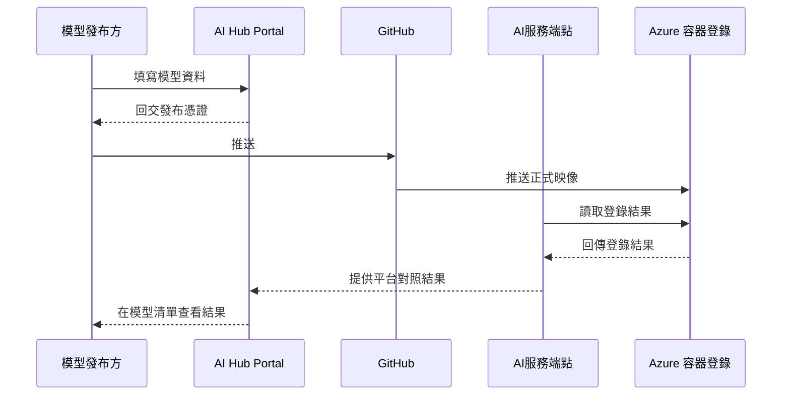

# 模型發布與容器化

## 這份文件會幫你完成什麼

這份文件會說明 AI Hub 在模型發布與容器化這條主線上，實際會碰到哪些平台資源、這些資源各自處理什麼，以及平台後面怎麼查證與對照。這份文件從模型發布方在 AI Hub Portal 的 **個人工作區 > 我的模型 > 新增模型** 送出上架資料這個起點出發，說明平台維護者後續需要掌握的承接節點，直到 AI Hub Portal 將 Azure 容器登錄與模型清單的對照結果顯示回平台為止。

這個章節會先說明模型發布與容器化的主流程，再從平台維護角度整理各個主體各自負責什麼。發布憑證會作為交付檔提供給後續交付流程使用，Azure 容器登錄（ACR）保存正式映像，模型小卡保存平台寫回的發布結果欄位，模型清單則顯示平台整理後的發布結果。接著，後續兩個子頁會依序展開映像檔如何沿著交付主線被送進 Azure 容器登錄，以及平台承接已登錄映像時使用的發布憑證與登錄資訊如何組成、形成並被後續對照使用。

## 主流程總覽

平台承接的模型上架主線分成三段。第一段，模型發布方在 **新增模型** 頁面送出模型資料，AI Hub Portal 回交發布憑證（`model_card.yaml`）。第二段，模型發布方把發布憑證放入 GitHub 開發模板，推送專案後由 CI/CD自動交付流程完成建置、測試與推送，正式映像進入 Azure 容器登錄。第三段，AI服務端點讀取登錄結果，寫回模型小卡，並把平台可顯示的結果交給模型清單。

若要先看這五個主體之間如何交接，可以先看圖 1。圖 1 只用來固定整條上架主線，不取代後面子頁對映像檔交付流程，或平台承接發布憑證與登錄資訊的細節說明。

圖 1、模型發布方、AI Hub Portal、GitHub、AI服務端點與 Azure 容器登錄之間的責任交接順序。

圖 1 固定上架資料、GitHub 交付、Azure 容器登錄與模型清單之間的交接順序。平台維護者先在模型清單查看發布結果；需要查證來源時，再回到模型小卡中的發布結果欄位。

## 平台要維護哪些資源

這一節用來對照模型發布主線中，各個平台主體各自要維護哪些內容：

1. AI Hub Portal：承接模型發布方送出的上架資料與 AI服務端點回交的對照結果，負責交付發布憑證，並在模型清單顯示最終可觀察結果。
2. GitHub：承接模型發布方推送的專案內容，負責透過 CI/CD自動交付流程執行建置、測試與發布流程，並留下平台後續交付與對照所需的自動上架證據。
3. Azure 容器登錄：承接 CI/CD自動交付流程推送的正式映像，負責保存平台後續要承接與對照的雲端資源。
4. AI服務端點：承接 Azure 容器登錄中的登錄結果，寫回模型小卡的發布結果欄位，再整理模型清單可顯示的發布結果。

上述四個平台主體共同承接圖 1 所固定的模型發布主線，其中資料建檔與模型小卡固定所依附的內部持久化基礎是 **資料庫**。如果你要看這條主線如何沿著 Portal、GitHub、CI/CD自動交付流程與 Azure 容器登錄往下走，就看 [映像檔交付流程](preparation.md)；如果你要看平台承接已登錄映像時使用的固定承接資訊由哪些部分組成、如何形成，以及完成後要保證什麼，就看 [發布憑證與登錄資訊](content-validation.md)。

## 接下來看哪一頁

這一節用來對照目前要確認的是哪一段處理內容，供平台維護者快速判斷下一步該讀哪一頁。

| 目前要確認的事 | 對應頁面 |
| --- | --- |
| 查看同一筆上架申請如何經過 Portal、GitHub、CI/CD自動交付流程與 Azure 容器登錄，形成正式映像結果 | [映像檔交付流程](preparation.md) |
| 如果你要看平台承接已登錄映像時，固定承接資訊由哪些部分組成、如何形成，以及完成後要保證什麼 | [發布憑證與登錄資訊](content-validation.md) |
