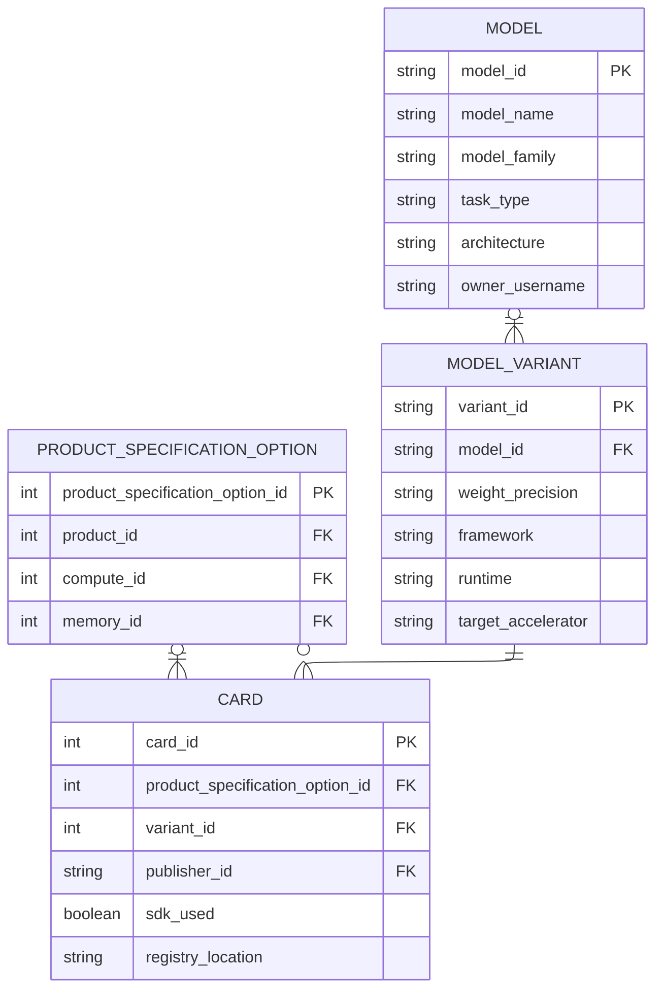
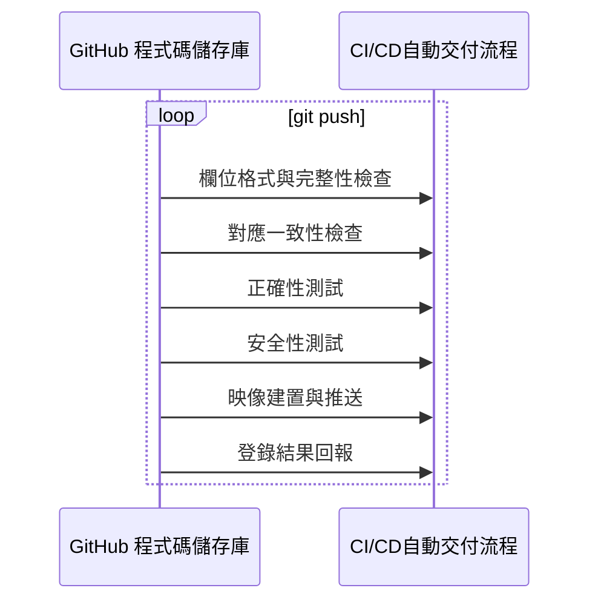

# 映像檔交付流程

## 這份文件會幫你完成什麼

當平台維護者要確認模型發布方如何從 AI Hub Portal 的 **個人工作區 > 我的模型 > 新增模型** 取得發布憑證，並一路完成模型清單中的模型選項上架，就看這一頁。

這個章節會從資料建檔、映像交付與結果查證三個面向，說明映像檔交付流程在 AI Hub 內部是怎麼進行的。首先，說明新增模型頁面收下指定的部署裝置與模型資料後，平台怎麼整理成資料庫紀錄，並匯出製作模型容器所需的發布憑證（`model_card.yaml`）；其次，說明這個流程怎麼透過 [GitHub 範例程式庫](https://github.com/R300-AI/model-card-package-template) 完成 CI/CD自動交付流程；最後，說明這個過程怎麼把模型正確發布到模型清單。

## 平台如何完成映像交付

接下來的各節會依序說明平台如何承接模型上架申請、建立資料庫紀錄、交付發布憑證、完成 CI/CD自動交付流程，並把發布結果寫回模型小卡與模型清單。

### 接收上架與資料建檔

平台承接模型上架申請時，AI Hub Portal 會先收下三類輸入：部署裝置、模型架構資料與 OpenAI SDK 支援資訊。部署裝置用來固定執行環境，模型架構資料用來描述模型運算需求，OpenAI SDK 支援資訊用來決定 CI/CD自動交付流程是否執行相容性查驗。這三類輸入會支援後續資料建檔、發布憑證產生與結果查證。

圖 2 整理上架資料在資料庫中的承接關係。讀圖時先確認模型小卡如何依部署裝置連到產品規格選項，再確認模型小卡如何以 `variant_id` 連到模型變體、並由模型變體回到模型資料；CI/CD自動交付流程完成映像交付後，OpenAI SDK 驗證結果（`sdk_used`）與登錄位置（`registry_location`）會更新到同一張模型小卡。

圖 2、既有產品規格選項、模型資料與模型小卡之間的固定關聯。

### 映像檔形成與登錄交付

模型發布方在 **新增模型** 頁面完成設定後，會下載發布憑證並放入 GitHub 範例程式庫，接著把專案內容推送到 GitHub 程式碼儲存庫。CI/CD自動交付流程會依 `.github/workflows` 的設定接手檢查、測試、建置、推送與結果回報。圖 3 整理交付內容進入 CI/CD自動交付流程後的主要處理順序。

圖 3、GitHub 程式碼儲存庫進入 CI/CD自動交付流程後的主要處理順序。

CI/CD自動交付流程接下來會依序完成六件事，把這次交付內容整理成平台可以直接使用的發布結果：

1. 欄位格式與完整性檢查：確認**發布憑證**與相關交付材料具備正確格式與必要欄位。
2. 對應一致性檢查：確認模型資料、部署裝置對應、開發模板設定與模型 API 封裝內容，仍然對回前段已固定的同一筆模型上架資料。
3. 正確性測試：確認這次提交的模型 API、封裝內容與建置設定，能正確建置出後續可推送與可查證的正式映像。若發布憑證已宣告支援 OpenAI SDK，CI/CD自動交付流程會補做不依賴指定裝置的基本功能測試，並將結果寫入 OpenAI SDK 驗證結果（`sdk_used`）。
4. 安全性測試：確認這次交付形成的映像與附帶材料，不會把帶有安全風險的封裝內容、設定或登錄材料帶入後續映像推送與結果寫入。
5. 映像建置與推送：將模型發布方提交到 GitHub 程式碼儲存庫的專案內容、發布憑證、開發模板與模型 API 封裝設計，建置為正式映像，並推送至 Azure 容器登錄（ACR）。
6. 發布結果寫入：把這次驗證與推送完成後實際產生的發布結果，直接寫入同一張模型小卡的發布結果欄位，讓下一節可以直接進行結果查證與平台對照。

表 1 整理 CI/CD自動交付流程完成後會寫回模型小卡的發布結果欄位，以及這些欄位在哪個測試或推送階段形成。

| 回傳欄位 | 所屬的測試階段 |
| --- | --- |
| OpenAI SDK 驗證結果（`sdk_used`）   | OpenAI SDK 基本功能測試 |
| 登錄位置（`registry_location`） | 將映像推送進 Azure 容器登錄（ACR） |

表 1、CI/CD自動交付流程完成後寫入模型小卡的發布結果。

當表 1 所列的發布結果都已完成寫入後，代表這次 CI/CD自動交付流程已完成交付，並已將同一筆模型上架資料對應的 OpenAI SDK 驗證結果（`sdk_used`）與登錄位置（`registry_location`）寫入同一張模型小卡。接下來，**AI服務端點** 就會以這張模型小卡作為直接讀取起點，整理後續平台對照與 **模型清單** 顯示所需的發布結果。

### 發布結果的後續使用

模型上架完成後，平台會先在 AI Hub Portal 的 **模型清單** 顯示登錄位置（`registry_location`）與 OpenAI SDK 驗證結果（`sdk_used`）。這兩項結果都是模型小卡中的發布結果欄位值，也是平台後續對照這筆上架資料是否完成發布的直接依據。後續終端使用者會在裝置頁面的「支援模型」列表中，依自己的需求選擇要部署的模型；平台能提供這個部署選項，會直接依賴前面已寫入的登錄位置。

OpenAI SDK 驗證結果則會影響平台後續在模型頁面中是否要提供 OpenAI 官方預設的使用文件，或保留由模型發布方自行填寫說明。也就是說，模型清單中的這兩項結果，後續會分別對應裝置頁面的模型部署選擇，以及平台是否提供 API 使用文件。

要讓這些後續流程成立，前提是前面交付流程中所依附的 **發布憑證** 與登錄資訊都仍然完整可對回。下一頁要確認的，就是 [發布憑證與登錄資訊](content-validation.md) 中定義的欄位、格式、登錄位置與結果寫入條件，是否在整個交付過程中都沒有被改動或破壞。
